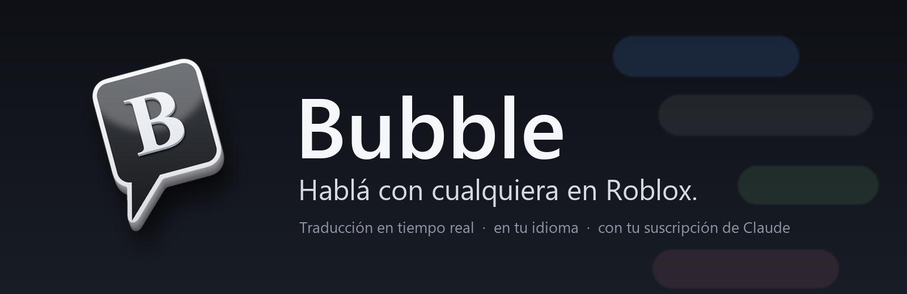
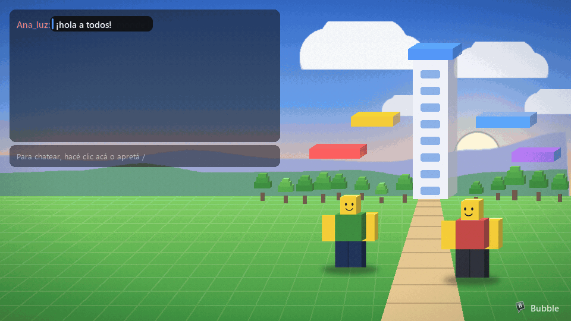
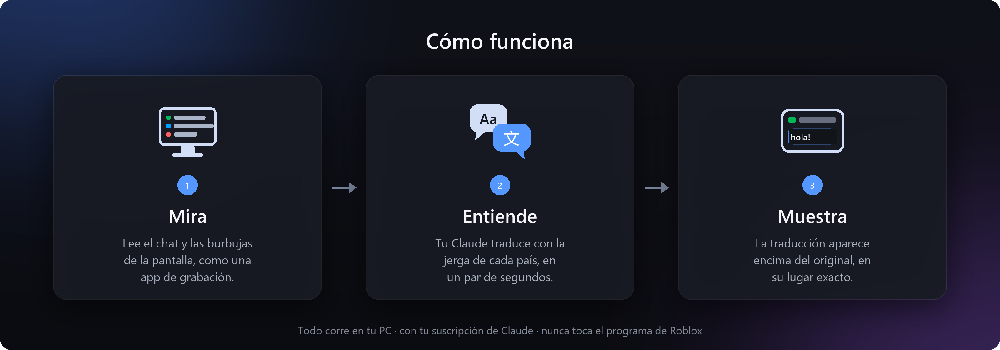
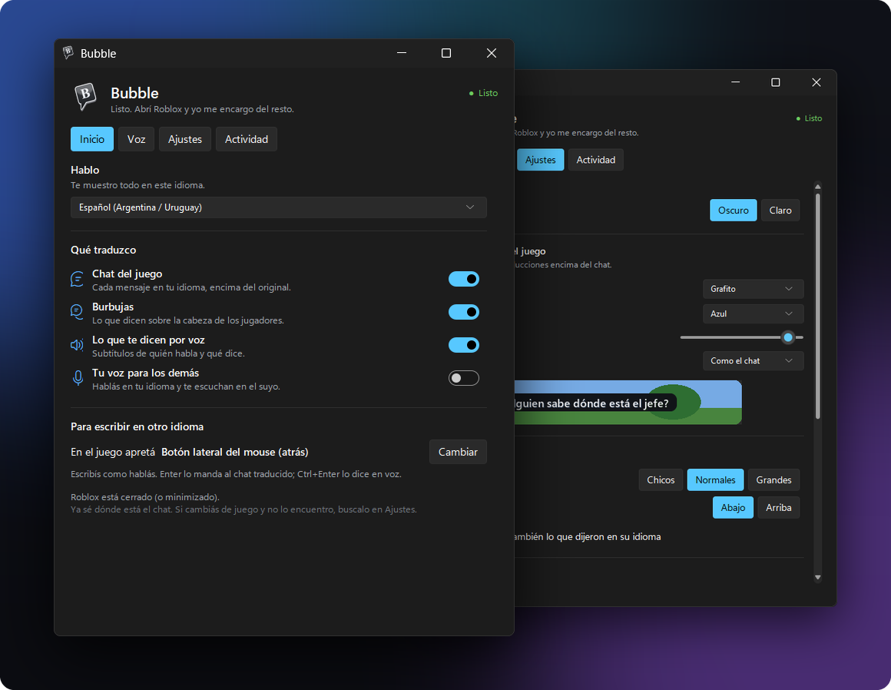
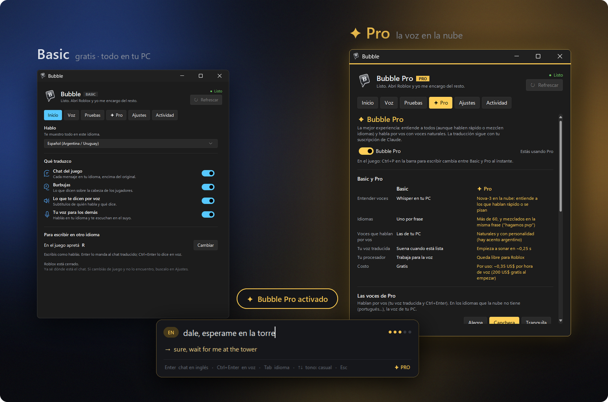
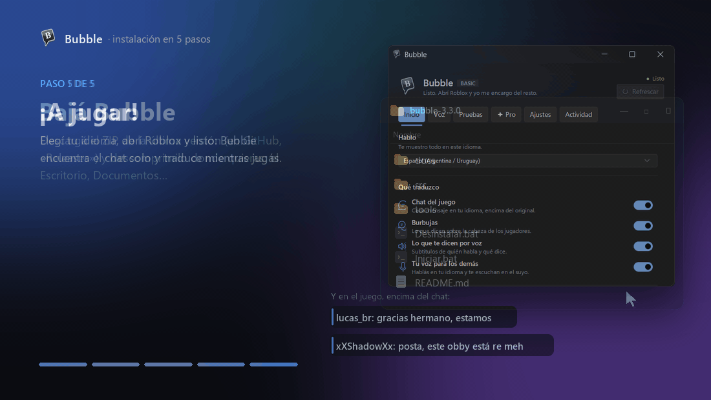
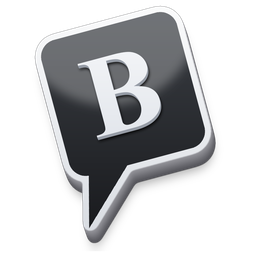

  

  
  
  
  
  

<h3 align="center">El idioma no debería ser una pared.</h3>

  En un mismo servidor de Roblox juegan chicos de Brasil, de India, de Francia, de México y de Argentina. 
  Se cruzan, se piden ayuda, se ríen… y muchas veces no se entienden. 
  <b>Bubble existe para que nadie se quede afuera de una conversación.</b>

 

  

  Ilustración animada. Las traducciones, la barra para escribir y los subtítulos son los de Bubble, dibujados con su mismo código.

 

## Cómo funciona

  

No traduce palabra por palabra: entiende la jerga — *vlw mano, tmj* · *ngl this obby is mid* · *mdr jsp* — y te la
cuenta como la diría alguien de tu barrio.

 

## Lo que hace

**Lee el chat.** Cada mensaje en otro idioma se traduce encima de sí mismo. El nombre del jugador queda a la vista y
lo que ya está en tu idioma no se toca.

**Traduce las burbujas.** Los globos sobre la cabeza de los jugadores también, y la traducción los sigue cuando
movés la cámara.

**Escribe por vos.** Apretá **°**, escribí como hablás y apretá **Enter**: sale traducido al chat. Mientras escribís
ves cómo va a quedar. Bubble solo abre el chat, escribe y envía; no toca ninguna otra tecla del juego.

**Te subtitula la voz.** Lo que te dicen por voz aparece abajo, como en una película: quién habla (Voz 1, Voz 2…)
y qué dice, en tu idioma, casi al instante. Escucha solo a Roblox: ni Discord ni la música que tengas de fondo.

**Habla por vos.** Tocás un botón, hablás en tu idioma y, ~2 s después de que terminás, los demás te escuchan en
el suyo, con una voz femenina o masculina (también en modo directo o escribiendo, con Ctrl+Enter). Entiende tus
pausas, tus preguntas y tus gritos, y aprende tu forma de hablar. Como Soundpad, sale por tu micrófono en Roblox.
[Cómo activarla](docs/GUIA.md#voz).

 

## La app

  

Elegís tu idioma y prendés lo que quieras. Después, jugás: Bubble encuentra el chat solo y trabaja en silencio.

**Hacelo tuyo:** tema oscuro o claro, el color, la opacidad y el tamaño de las traducciones en el juego, y dónde y
cómo se ven los subtítulos.

**Probalo sin jugar:** en **Pruebas** ves si tu micrófono va a andar bien, normal o mal, cómo entiende y traduce tu
voz (y cuánto tarda cada paso), y cómo va a andar Bubble en tu PC. Y si querés, **entrenás tu voz** en 5 minutos:
leés unas frases de juego y contestás con tus palabras, y aprende tu vocabulario, tus expresiones, cómo preguntás y
cómo gritás. [Más](docs/GUIA.md#pruebas).

 

## ✦ Bubble Pro

  

  <b>El mismo Bubble, con oídos y voz de primera.</b> 
  Basic es gratis y corre todo en tu PC. Pro lleva la voz a la nube: entiende a todos y habla por vos con personalidad.

| | **Basic** · gratis | **✦ Pro** |
|---|---|---|
| **Entender voces** | Whisper, en tu PC | Nova-3 en la nube: entiende a los que hablan rápido o se pisan |
| **Idiomas** | uno por frase | más de 60, y mezclados en la misma frase (*"hagamos pvp"*) |
| **Voces que hablan por vos** | las de tu PC | naturales y con personalidad: alegre, canchera o tranquila (hay acento argentino) |
| **Tu voz traducida** | suena cuando está lista | empieza a sonar en **~0,35 s**, sin cortes |
| **Tu procesador** | trabaja para la voz | queda libre para Roblox |
| **Se ve** | como siempre | dorado, adentro y afuera del juego |
| **Costo** | gratis | por uso, con tu cuenta de Deepgram: **~0,35 US$ por hora de voz** (la cuenta nueva trae 200 US$) |

**Cambiás en el momento.** En la barra para escribir, **Ctrl+P** pasa de Basic a Pro (o al revés) sin salir del
juego, y un aviso dorado te lo confirma.

**Gasta lo justo.** Solo se manda voz cuando alguien habla (los silencios no se pagan), ni las voces lejanas ni los
ruidos, nada fuera del juego, y una frase que ya se dijo (*"gg"*, *"gracias"*) no se vuelve a pagar. Quién habla lo
reconoce tu PC, gratis. En la página **✦ Pro** ves cuánto usaste este mes.

**Siempre funciona.** Si se corta internet, esa frase la entiende tu PC. Si la cuenta se queda sin saldo, Bubble
vuelve solo a Basic y te avisa. La traducción, en los dos planes, la hace tu suscripción de Claude.
[Cómo se activa](docs/GUIA.md#bubble-pro).

 

## Hecho para cualquier juego

- **Encuentra el chat solo**, esté donde esté: arriba, abajo, más grande o más chico.
- **Lee con cualquier fondo:** noche, nieve, cielo, o con el chat transparente.
- **Se adapta a tu PC:** mira tu memoria, tu procesador, tu pantalla y tu internet, y se acomoda solo: captura con
  la placa de video, regula cuánto trabaja y hasta el tamaño de la ventana, para no quitarle fluidez al juego.
- **Anda con el Roblox que tengas:** el de roblox.com, con Bloxstrap o el de la Microsoft Store.
- **Sale en tus clips:** las traducciones y los subtítulos aparecen en tus capturas y en tus grabaciones de pantalla,
  para que le muestres a tus amigos cómo te entendiste con alguien de la otra punta del mundo.
- **Entiende el chat como una conversación:** mensajes repetidos, spam, avisos del juego y mensajes viejos cuando
  subís en el chat.
- **Escucha a los que tenés cerca:** con el radio de escucha, las voces de la otra punta del mapa no se traducen, y
  los ruidos (música, explosiones, risas) tampoco.
- **Se mueve suave:** las traducciones, los subtítulos y la barra para escribir aparecen con una animación corta, sin
  parpadeos.

 

## Tu PC, tu cuenta

Bubble corre en tu computadora y traduce con **tu propia suscripción de Claude**, a través de Claude Code. No hay
claves que pegar ni servidores de por medio. En Basic la voz se reconoce y se sintetiza en tu PC; con Pro, en la nube
de Deepgram, con tu cuenta. Claude solo ve texto.
Cada traducción usa muy poco (medido: [cuánto usa de tu suscripción](docs/USO-DE-CLAUDE.md)).

Nunca toca el programa de Roblox: solo mira la pantalla, como una app de grabación, y escribe como lo harías vos.

 

## Empezar

  

Necesitás Windows 10 u 11 y tu suscripción de Claude (Pro o Max). Nada más: **bajá Bubble, doble clic en
`Iniciar.bat` y listo.** La primera vez prepara todo solo —Python si falta, el reconocimiento de voz y las voces— y
lo que necesita tu permiso ([Claude Code](https://claude.com/claude-code), tu sesión y el micrófono virtual) te
espera con su botón. **[La instalación paso a paso, con imágenes →](docs/INSTALACION.md)**

**Desinstalar** también es un clic: **Ajustes → Desinstalar Bubble…** (o `Desinstalar.bat`). Elegís qué borrar —tu
configuración, los modelos descargados, el acceso directo, el micrófono virtual y la carpeta— y Windows vuelve a usar
tu micrófono de siempre.

Un tutorial corto te acompaña la primera vez. Para lo demás —configuración, cómo está hecho, cómo probarlo— está
la [guía completa](docs/GUIA.md).

**¿Algo no anda o se te ocurrió algo?** Contalo desde Bubble mismo, en **Soporte** (abajo de todo en la ventana):
escribís qué pasó, sumás una captura si querés, y le llega directo a quien lo hace.

 

## En números

Medido con el simulador de pruebas, con chats lentos, rápidos y en ráfagas:

| | |
|---|---|
| Mensajes detectados | **100 %** |
| Traducción lista | **~2 s** desde que aparece el mensaje |
| Parpadeos y traducciones fuera de lugar | **0** |
| Mensajes en tu idioma enviados a traducir | **ninguno** |

Y con grabaciones reales de Roblox (chat sin fondo, burbujas apiladas y voces con ruido del juego):

| | |
|---|---|
| Mensajes del chat encontrados | **17 a 18 de 18**, ninguna traducción fuera del chat |
| Burbujas | el texto entero siempre (aunque la burbuja quede tapada), sin tomar íconos ni carteles |
| Voces del juego | todas las frases; la mitad de errores que antes en voces rápidas y con ruido |

Y con el laboratorio de voz (varias personas, siete idiomas, música de fondo):

| | |
|---|---|
| Ves lo que dicen | a los **0,5 s** de que empiezan a hablar |
| La traducción | **~2 s** después de que terminan |
| Tu voz traducida | suena **~2 s** después de que terminás (antes ~4,7 s) |
| Quién habla | acierta **9 de cada 10** frases o más |

Y con Bubble Pro (medido con una cuenta real de Deepgram):

| | |
|---|---|
| Voz de la nube | empieza a sonar en **0,31 a 0,40 s**, sin cortes (esperando la frase entera: 1 a 2,5 s) |
| Tu voz con el botón | se entiende **mientras hablás**: sabe que terminaste a los **~0,9 s** y el texto ya está · con *pvp*, *Blox Fruits* y *farmear* bien escritos |
| Frases largas | la primera oración traducida suena mientras se traduce el resto |
| Conexión en vivo | sigue abierta en los silencios largos · **14 s** sin hablar, sin cortes |
| Costo de toda esa prueba | **0,006 US$** |

 

   
  Hecho con cariño para que el idioma no sea una pared.

