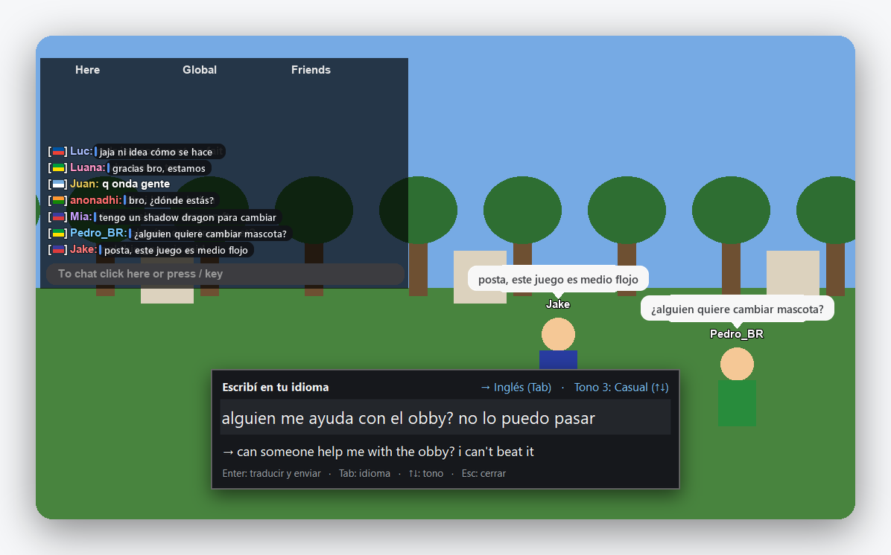

<p align="center">
  
</p>

<p align="center">
  
  
  
</p>

<br>

En un mismo servidor de Roblox juegan chicos de Brasil, de India, de Francia, de México y de Argentina. Se cruzan,
se piden ayuda, se ríen, se invitan a jugar… y muchas veces no se entienden.

**Bubble existe para que nadie se quede afuera de una conversación.**

Traduce el chat mientras jugás: lo que te escriben aparece en tu idioma, encima del mensaje original, y lo que
escribís vos sale en el idioma de los demás. No traduce palabra por palabra: entiende la jerga — *vlw mano, tmj* ·
*ngl this game is mid* · *mdr jsp* — y te la cuenta como la diría alguien de tu barrio.

<br>

<p align="center">
  
  <br>
  <sub>Vista de ejemplo sobre el simulador de pruebas de Bubble.</sub>
</p>

<br>

## Lo que hace

**Lee el chat.** Cada mensaje en otro idioma se traduce encima de sí mismo, en su lugar exacto. El nombre del
jugador queda a la vista y lo que ya está en tu idioma no se toca.

**Traduce las burbujas.** Los globos sobre la cabeza de los jugadores también, y la traducción los sigue cuando
movés la cámara.

**Escribe por vos.** Apretá **°**, escribí como hablás y apretá **Enter**: sale traducido al chat. Bubble solo abre
el chat, escribe y envía. No toca ninguna otra tecla del juego.

<br>

## Hecho para cualquier juego

- **Encuentra el chat solo**, esté donde esté: arriba, abajo, más grande o más chico.
- **Lee con cualquier fondo:** noche, nieve, cielo, o con el chat transparente.
- **Se adapta a tu PC:** captura la pantalla con la placa de video y regula cuánto trabaja según tu procesador,
  para no quitarle fluidez al juego.
- **Entiende el chat como una conversación:** mensajes repetidos, spam, avisos del juego y mensajes viejos cuando
  subís en el chat.

<br>

## Tu PC, tu cuenta

Bubble corre en tu computadora y traduce con **tu propia suscripción de Claude**, a través de Claude Code. No hay
claves que pegar ni servidores de por medio.

Nunca toca el programa de Roblox: solo mira la pantalla, como una app de grabación, y escribe como lo harías vos.

<br>

## Empezar

Necesitás Windows 10 u 11, Python 3.12 y [Claude Code](https://claude.com/claude-code) con tu sesión iniciada.

```powershell
python -m venv .venv
.venv\Scripts\python.exe -m pip install -e .
.\Iniciar.bat
```

Un tutorial corto te acompaña la primera vez. Para lo demás —configuración, cómo está hecho, cómo probarlo— está
la [guía completa](docs/GUIA.md).

<br>

## En números

Medido con el simulador de pruebas, con chats lentos, rápidos y en ráfagas:

| | |
|---|---|
| Mensajes detectados | **100 %** |
| Traducción lista | **~2 s** desde que aparece el mensaje |
| Las traducciones siguen al chat | en **0,06 s** |
| Mensajes en tu idioma enviados a traducir | **ninguno** |

<br>

## Nuevo: voz (beta 2.0)

**Subtítulos de lo que te dicen por voz**, y **tu voz traducida** al idioma de los demás: mantenés apretado un botón,
hablás, y los demás te escuchan en su idioma. Todo el audio se procesa en tu PC; Claude solo traduce el texto.
[Cómo activarla](docs/GUIA.md#voz-beta-20).

<br>

<p align="center">
  <sub>Hecho con cariño para que el idioma no sea una pared.</sub>
</p>
