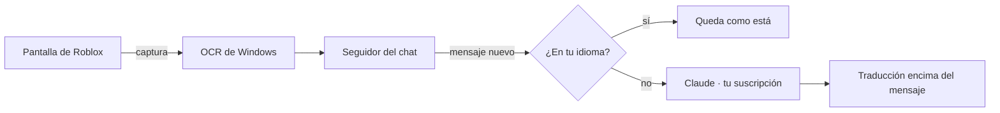

# Guía de Bubble

Acá está todo lo que no entra en la portada: cómo se instala, cómo se usa cada parte, qué se puede configurar y
cómo funciona por dentro. No hace falta leerla de corrido; buscá lo que necesites.

- [Instalación y actualizaciones](#instalación-y-actualizaciones)
- [Primer uso](#primer-uso)
- [La ventana](#la-ventana)
- [Bubble en tu idioma](#bubble-en-tu-idioma)
- [Leer el chat y las burbujas](#leer-el-chat-y-las-burbujas)
- [Escribir en otro idioma](#escribir-en-otro-idioma)
- [Voz](#voz)
- [Pruebas](#pruebas)
- [Bubble Pro](#bubble-pro)
- [Jerga, dialectos y tono](#jerga-dialectos-y-tono)
- [Idiomas](#idiomas)
- [Configuración](#configuración)
- [Cómo está hecho](#cómo-está-hecho)
- [Probarlo sin Roblox](#probarlo-sin-roblox)
- [Soporte y Acerca de](#soporte-y-acerca-de)
- [Si algo no anda](#si-algo-no-anda)

---

## Instalación y actualizaciones

> ¿Primera vez? Mejor mirá la [instalación en 5 pasos, con imágenes](INSTALACION.md).

**Doble clic en `Iniciar.bat`.** La primera vez se encarga de todo:

1. Busca **Python** (3.12 o más nuevo, de 64 bits). Si no tenés uno que sirva, te ofrece instalarlo.
2. Arma su propio entorno (`.venv`) con lo que necesita.
3. Abre **Preparar Bubble**, que baja el resto con una barra de progreso: el reconocimiento de voz (hasta ~500 MB),
   el de voces (~30 MB) y las voces en inglés (~120 MB). Mientras tanto podés seguir usando la PC.
4. Lo que necesita tu permiso te espera con su botón: los componentes de Windows que falten, Claude Code, tu cuenta
   de Claude y el micrófono virtual.

Después queda un acceso directo **Bubble** en el escritorio. Cada vez que abre, revisa en segundo plano que no falte
nada; si falta algo, vuelve a abrir **Preparar Bubble**. También lo podés pedir desde **Ajustes → Revisar
instalación**.

Anda con el Roblox de la web (también con Bloxstrap) y con el de la Microsoft Store.

Si lo vas a tocar por dentro: `python -m venv .venv` y `.venv\Scripts\python.exe -m pip install -e ".[voz,dev]"`.

**Actualizaciones.** Al abrir, Bubble se fija en GitHub si salió algo nuevo (dos veces por día como mucho). Si hay,
te cuenta qué trae y te pregunta si actualizar ahora o más tarde.

- **Ahora:** baja la versión nueva, se cierra, cambia sus archivos y vuelve a abrir. Tarda menos de un minuto. Tu
  configuración, tu clave de Pro, lo que aprendió de tu voz y los modelos no se tocan. Si algo sale mal, te deja la
  versión que tenías.
- **Más tarde:** no te vuelve a preguntar hasta el día siguiente. Mientras, abajo de la ventana queda el link
  **↑ Actualizar a la X**.
- **Nunca en medio de una partida.** Si estás jugando, espera a que salgas del juego.
- **Actualizar solo** (en Ajustes): si lo prendés, no te pregunta nada. Cada dos horas se fija si hay algo nuevo,
  lo baja sin molestarte y lo instala cuando no estás jugando ni usando Bubble. Si cerrás Bubble con una versión ya
  bajada, se instala al cerrar.
- Para buscar vos: **Ajustes → Buscar actualizaciones**.
- Si tu copia es de desarrollo (con git), se actualiza con `git pull`, y solo si no tenés cambios sin guardar.

**Desinstalar:** **Ajustes → Desinstalar Bubble…** o `Desinstalar.bat`. Elegís qué borrar: tu configuración y lo
aprendido, los modelos y las voces (te dice cuánto ocupan), el acceso directo, el micrófono virtual y la carpeta de
Bubble (si es de desarrollo, esa no se borra nunca). Antes de borrar nada, Windows vuelve a usar tu micrófono y tu
parlante de siempre.

## Primer uso

La primera vez te acompaña un tutorial corto. Lo podés saltar y volver a verlo desde **Ajustes → Ver el tutorial**.

1. Abrí Bubble. Cuando arriba dice **Listo**, ya está conectado con tu Claude.
2. Abrí Roblox, en ventana o en pantalla completa.
3. **Apagá la traducción automática de Roblox** (Esc → Configuración → Traducción automática del chat). Si no,
   Bubble lee lo que ya tradujo Roblox y se pierde la jerga original.
4. Con un par de mensajes a la vista, Bubble encuentra el chat solo. Si en algún juego no lo encuentra, **Ajustes →
   Buscar el chat** o **Marcarlo a mano** (arrastrás un rectángulo sobre los mensajes).

Si querés ver qué está leyendo, **Ajustes → Probar lectura** lo muestra en **Actividad** y guarda imágenes en
`%LOCALAPPDATA%\Bubble\debug`.

## La ventana

Tiene cinco páginas:

| Página | Qué hay |
|---|---|
| **Inicio** | Tu idioma, cuatro interruptores (el chat, las burbujas, lo que te dicen por voz y tu voz para los demás) y la tecla para escribir. |
| **Voz** | En qué idioma te escuchan, cómo se traduce tu voz (con botón o directo), voz de mujer o de hombre, velocidad y micrófono. |
| **Pruebas** | Para probar todo sin jugar: tu micrófono, tu voz traducida, lo que te dicen y tu PC. |
| **Ajustes** | El idioma de Bubble, el tema, cómo se ven las traducciones y los subtítulos, al escribir, el chat de Roblox, el rendimiento y las actualizaciones. |
| **Actividad** | Todo lo que se fue traduciendo, y un lugar para probar sin Roblox. |

Al abrir aparece un cartelito con el logo mientras carga lo pesado (la conexión con Claude, la lectura del chat y la
voz). La ventana aparece recién cuando está lista, así no se traba en los primeros segundos.

## Bubble en tu idioma

Bubble se muestra en el idioma de tu Windows. Si alguien de Brasil lo abre, lo ve en portugués; si es de Japón, en
japonés. Esto no tiene nada que ver con tu idioma para traducir: podés tener Bubble en inglés y que te traduzca al
español, si querés.

- Vienen listos los 20 idiomas más jugados: español, inglés, portugués, francés, alemán, italiano, ruso, turco,
  polaco, indonesio, tagalo, vietnamita, tailandés, árabe, japonés, coreano, chino, hindi, neerlandés y ucraniano.
- Si tu idioma no está entre esos, Bubble lo muestra en inglés la primera vez y, apenas se conecta con tu Claude, se
  traduce solo en segundo plano. La próxima vez que lo abras ya lo ves en tu idioma. Esa traducción queda guardada en
  `%APPDATA%\Bubble\idiomas`.
- Para cambiarlo: **Ajustes → Idioma de Bubble**. Automático es el de Windows. Al cambiarlo, Bubble se reinicia.

## Leer el chat y las burbujas

**El chat.** Cada mensaje en otro idioma se traduce encima de sí mismo, dejando a la vista el nombre del jugador. Lo
que ya está en tu idioma queda como está.

- La traducción aparece de una vez, terminada, unos 2 segundos después del mensaje.
- Si el mensaje ocupa dos renglones y la traducción es corta, se reparte entre los dos, así no queda un renglón tapado
  y vacío.
- Solo se traducen los mensajes nuevos: si subís en el chat, lo viejo no se toca. Cuando el chat se mueve, las
  traducciones se mueven con él.
- Los avisos del juego (`[SYSTEM]`, "has joined the game", "(+25)") y el spam no se traducen.
- Si cerrás el chat o salís de Roblox, las traducciones se esconden.

**Las burbujas** que salen sobre la cabeza de los jugadores:

- La traducción sigue a la burbuja cuando movés la cámara y aparece más o menos un segundo después.
- Si el mismo mensaje está en el chat y en la burbuja, se traduce una sola vez.
- Las burbujas apiladas del mismo jugador se separan, y si la traducción es más larga que el original, la burbuja
  crece en vez de cortar el texto.
- Si una burbuja pasa por detrás del chat, su traducción también queda tapada, como el original.

**Idiomas que se leen de derecha a izquierda** (árabe, hebreo, persa, urdu): se dibujan en el orden correcto y, en
árabe, con las letras unidas como corresponde.

**En tus capturas y grabaciones.** Las traducciones, los subtítulos y los avisos salen cuando sacás una captura
(**Win + Shift + S**, **Impr Pant**, la Herramienta Recortes), cuando grabás con **OBS** y cuando compartís pantalla en
**Discord**. Para que eso ande, Bubble lee el chat directo de la ventana de Roblox, sin leerse a sí mismo. Si en tu PC
Windows no se lo permite, vuelve a leer la pantalla y las traducciones salen solo con Impr Pant y Win + Shift + S.
**Ajustes → Traducciones en el juego** te dice cuál de las dos está usando.

El grabador de Roblox y la Xbox Game Bar graban solo el juego: ahí no sale nada de lo que esté encima.

## Escribir en otro idioma

En el juego apretá el atajo (**°** por defecto) y se abre una barra para escribir. Escribí como hablás: abajo, en
celeste, vas viendo cómo va a quedar.

| Tecla | Qué hace |
|---|---|
| **Enter** | Lo traduce y lo manda al chat de Roblox. |
| **Ctrl+Enter** | Lo dice en voz en vez de mandarlo al chat. |
| **Tab** / **Shift+Tab** | Pasa al idioma siguiente o vuelve al anterior. Arriba ves los idiomas de al lado y en cuál estás (por ejemplo, 3/59). |
| **↑** / **↓** | Cambia el tono. También podés hacer clic en los puntitos. |
| **Ctrl+G** | Voz de mujer o de hombre. También con un clic en «♀ Mujer» / «♂ Hombre». |
| **Ctrl+P** | Pasa de Basic a Pro y al revés. |
| **Esc** | Cierra. Si la volvés a abrir enseguida, lo que escribiste sigue ahí. |

Con Pro también aparece la personalidad de la voz (Alegre, Canchera o Tranquila): un clic y pasa a la siguiente.

Algunas cosas que conviene saber:

- Con Tab están **todos** los idiomas: primero los del chat y los más comunes, después el resto por orden alfabético.
- Bubble solo hace tres cosas en Roblox: abre el chat con su tecla, escribe el mensaje y aprieta Enter. Nada más.
- Si el atajo lleva Shift (como «°»), podés apretar la tecla sola: en Roblox el Shift mueve la cámara.
- El atajo solo anda con Roblox al frente. En otros programas la tecla escribe normal.
- Para cambiarlo: **Cambiar**, en Inicio, y apretá la tecla o el botón del mouse que quieras.

**Un solo idioma para todo.** El idioma de la barra es el mismo para el chat, para Ctrl+Enter y para tu voz: si
pasás a inglés con Tab, tu voz también sale en inglés, y la próxima vez sigue en inglés. En automático, la primera vez
elige el que más se usa en el chat. Si el servidor mezcla idiomas, **Todos los del chat** manda el mensaje en varios a
la vez.

## Voz

En Basic, todo el audio se procesa en tu PC: **Whisper** entiende lo que se dice, un modelo chico reconoce quién
habla y **Piper** pone la voz. Claude solo ve el texto. La primera vez se bajan los modelos (hasta ~500 MB según tu
PC) y cada voz que uses (~60 MB); quedan en `%LOCALAPPDATA%\Bubble\models`.

### Lo que te dicen

Prendé **Lo que te dicen por voz**, en Inicio, y lo que dicen los demás aparece subtitulado abajo.

- Mientras la persona habla ves lo que va diciendo en gris. Apenas hace una pausa, llega la traducción en blanco,
  unos 2 segundos después.
- Cada persona tiene su color y su número (**Voz 1**, **Voz 2**…), y Bubble la reconoce cuando vuelve a hablar.
- Se nota **cómo lo dijeron**: si preguntaron, si gritaron, si exclamaron. Bubble lo mide en el audio y la traducción
  sale con sus signos y su emoción.
- **Las frases largas no se cortan.** Si tu amigo habla un rato largo, el subtítulo suma renglones antes de achicar la
  letra, y se queda en pantalla el tiempo que hace falta para leerlo.
- Lo que ya está en tu idioma no se subtitula.

**Radio de escucha** (página Voz): en Roblox, los que están lejos se escuchan más bajo. Bubble aprende cómo suenan
los que tenés cerca y deja afuera a los lejanos: **Cerca**, **Normal**, **Lejos** o **Todas**. Si nadie habla cerca
por un rato, el radio se va abriendo solo.

**Filtro de ruido:** música, explosiones, risas y balbuceos no se traducen.

En Windows 11 se escucha **solo el sonido de Roblox**: Discord, un video o tu música no se subtitulan. Si no estás en
el juego, no se escucha nada (no gasta procesador y, con Pro, no se paga).

### Tu voz, traducida

Prendé **Tu voz para los demás**, en Inicio. En la página **Voz** elegís cómo:

- **Con un botón** (por defecto, el botón lateral del mouse de adelante): lo tocás y hablás, o lo mantenés apretado
  mientras hablás.
- **Directo:** hablás normal y cada frase sale traducida unos 2 segundos después. Solo escucha mientras estás en
  Roblox.
- **Escribiendo:** Ctrl+Enter en la barra para escribir.

Podés hablar un buen rato seguido: una frase traducida puede durar hasta un minuto. En frases largas, la primera
oración empieza a sonar mientras se traduce el resto.

**Tus pausas.** Cuando hacés una pausa, Bubble se fija si terminaste la idea. Si quedó a medias ("fui a buscar la
espada y…"), espera a que sigas. Así no te corta a mitad de frase.

**Cómo lo decís.** "¿Vamos a la torre?" y "vamos a la torre" tienen las mismas palabras; lo que cambia es cómo suena.
Bubble lo escucha en tu voz y la voz traducida lo acompaña:

| Si… | La voz traducida… |
|---|---|
| gritaste | sube, suena más fuerte y un poco más rápida |
| exclamaste | sube un poco y suena más fuerte |
| hablaste bajito | baja y suena más suave |
| preguntaste | sube al final |

Compara con cómo hablás vos normalmente, que va aprendiendo, así una afirmación con la entonación rioplatense no se
toma como pregunta.

**Aprende tu forma de hablar.** Cuanto más lo usás, mejor te entiende. Tus palabras y los nombres de tus amigos se los
pasa a Claude para que entienda qué quisiste decir aunque Whisper haya escuchado algo parecido. Las palabras de
Roblox (*robux*, *obby*, *gamepass*, *Bubble*…) ya las conoce. Lo que ya dijiste queda guardado: si volvés a decir
lo mismo, sale al instante. Todo queda en `%LOCALAPPDATA%\Bubble\perfil_voz.json`, solo en tu PC, y se borra desde
**Pruebas**.

**Cómo suena.** Voz de mujer o de hombre, velocidad y **Probar voz**. Con **Escucharla yo también**, tu voz traducida
suena bajito en tus auriculares, así sabés qué dijo.

- Casi todos los idiomas tienen voz de mujer y de hombre, elegidas a mano. Cuando Piper tiene una sola, la otra es una
  voz de Windows de ese idioma si la tenés o, si no, se arma a partir de la que hay (se le cambia el timbre y el tono).
- Algunos idiomas usan la voz de uno muy parecido: el croata y el serbio, la eslovena; el malayo y el tagalo, la
  indonesia; el bielorruso, la rusa.
- El tamil, el guyaratí y el panyabí no tienen voz en Piper: hablan con las voces de Windows si las agregaste
  (Configuración → Hora e idioma → Voz). Con Pro, la nube habla varios más.
- Cada frase se lleva al tono y al volumen de siempre de esa voz, así no parece otra persona cada vez.

### Que te escuchen los demás

Windows no deja que un programa hable "por tu micrófono"; hace falta un micrófono virtual. Bubble usa **VB-Audio
Virtual Cable**, que es gratis:

1. En **Voz → Micrófono**, tocá **Instalar (gratis)**. Windows pide permiso de administrador; en el instalador tocá
   **Install Driver**. Si te pide reiniciar, reiniciá.
2. Abrí Bubble. Si el instalador te cambió el micrófono o el parlante de Windows, Bubble lo deja como estaba.
3. Listo.

Mientras Bubble está abierto, el micrófono de Windows es el virtual y Bubble le pasa tu voz real en vivo: te escuchan
igual que siempre y, cuando suena la voz traducida, tu voz baja. Al cerrar Bubble, Windows vuelve a tu micrófono. Si
algo queda raro, **Voz → Arreglar Windows**.

- **Abrí Bubble antes que Roblox.** Roblox elige el micrófono una sola vez, al abrirse. Si ya estaba abierto, Bubble te
  avisa: elegí **CABLE Output** en Roblox (Esc → Configuración → Dispositivo de entrada) o volvé a abrir Roblox.
- Con **Pasar también mi voz real** apagado, solo escuchan la voz traducida.
- Discord también usa el micrófono de Windows. Si no querés que escuche la voz traducida, elegí ahí tu micrófono de
  verdad en vez de "Predeterminado".
- Tu micrófono en Roblox tiene que estar activado. Si hablás estando muteado, Bubble te avisa.
- ¿Por qué no como Soundpad? Soundpad se mete dentro de cada programa, y con Roblox eso choca con su anti-trampas. El
  micrófono virtual no toca Roblox.

El chat de voz de Roblox pide verificación de edad, y usar voz sintética puede ir contra sus reglas en algunos casos.
Usalo para comunicarte.

## Pruebas

Para probar todo sin jugar. Suena solo en tus auriculares; a Roblox no le llega nada.

- **Tu micrófono:** leés una frase y te dice si va a andar bien, normal o mal, y qué cambiar (subir el volumen,
  acercarlo, alejarlo del ventilador…).
- **Tu voz traducida:** hablás como en el juego y ves qué entendió, cómo lo dijiste, cómo lo tradujo y cuánto tardó.
  Si algo salió mal, lo corregís y tocás **Guardar**: aprende de eso.
- **Chat a voz:** como Ctrl+Enter.
- **Lo que te dicen:** una voz dice algo en inglés, como otro jugador, y ves el subtítulo.
- **Tu equipo:** lo que Bubble vio de tu PC (Windows, procesador, memoria, pantalla, micrófonos, Roblox, tu cuenta de
  Claude, internet) y cómo se acomodó. Si algo le impide andar, te lo dice.
- **Cuánto tarda en tu PC** (solo en Basic): cuánto tarda de verdad tu voz traducida en esta PC.
- **Lo que aprendió:** cuántas palabras y frases tuyas conoce. **Borrar lo aprendido** empieza de cero.

**Si Windows bloquea las voces.** En Windows 11, el **Control inteligente de aplicaciones** a veces no deja cargar una
parte de Piper. Bubble se da cuenta y usa las voces que trae Windows (suenan un poco menos naturales, pero andan).
Con Pro no cambia nada. No apagues esa protección: después no se puede volver a prender sin reinstalar Windows.

## Bubble Pro

Bubble viene en dos planes. **Basic** es gratis y todo corre en tu PC. **✦ Pro** manda la voz a la nube de
[Deepgram](https://deepgram.com), con tu propia cuenta, y entiende y habla mejor. La traducción, en los dos, la hace
tu Claude.

| | Basic (tu PC) | ✦ Pro (la nube) |
|---|---|---|
| Entender voces | Whisper | Nova-3: mucho mejor cuando hablan rápido, se pisan o mezclan idiomas |
| Idiomas mezclados | uno por frase | varios en la misma frase; si una frase sale dudosa, se vuelve a escuchar para saber bien el idioma |
| Voces que hablan por vos | Piper | Aura-2, y en inglés Flux, que suena con emoción |
| Tu voz traducida | suena cuando está lista | empieza a sonar mientras la nube la sigue armando |
| Palabras de Roblox | Whisper con ejemplos | la nube las prioriza (*robux*, *obby*, *Blox Fruits*, los nombres del chat…) |
| Tu procesador | trabaja para la voz | libre |
| Cómo se ve | como siempre | dorado |

**Las voces de Pro.** Tres personalidades, cada una con voz de mujer y de hombre: **Alegre** (con energía),
**Canchera** (casual, la de siempre) y **Tranquila** (calma). Hay voces en inglés, español, francés, alemán, italiano,
neerlandés y japonés, y si elegiste una región, la voz es de ahí: en México hablan Olivia y Javier; en España, Carina
y Álvaro; en Argentina, Antonia. En los demás idiomas habla la voz de tu PC. **Probar voz Pro** la hace sonar en tus
auriculares.

**En inglés, con tus ganas.** Las voces en inglés son las nuevas de Deepgram (Flux). Si gritás, la voz grita; si
hablás bajito, habla calma. Si Flux alguna vez no responde, habla la voz de antes (Aura) y no te enterás.

**Cambiar de plan:** en la página **✦ Pro**, o en el juego con **Ctrl+P** (o un clic en «BASIC» / «✦ PRO» en la
barra para escribir). Todo se rearma solo en menos de un segundo. Con Pro, lo de Basic que no se usa se ve
difuminado.

**Sin Claude.** Si todavía no tenés Claude Code, o tu cuenta de Claude es la gratis, Bubble te lo dice y te da dos
caminos:

- **Pro con el crédito de Deepgram:** Pro también traduce, con Claude Haiku a través de Deepgram. La cuenta nueva trae
  200 US$ de regalo. Una partida tranquila gasta centavos por hora.
- **Conectar Claude:** iniciás sesión (Claude Pro alcanza) y tocás **Listo, revisar**. La traducción deja de gastar
  crédito y se desbloquea Basic.

**Cuánto cuesta.** Se paga por uso, con tu cuenta de [Deepgram](https://console.deepgram.com/signup) (precios de
septiembre de 2026):

| | US$ |
|---|---|
| Voces del juego, en vivo | 0,0058 por minuto (~0,35 por hora) + 0,0013 por las palabras priorizadas |
| Tu voz, en vivo | 0,0048 por minuto + 0,0013 por las palabras priorizadas |
| Una frase con el botón | 0,0052 por minuto |
| Voces de Pro | 0,030 cada 1.000 letras (una frase típica, ~0,001) |
| Voces en inglés (Flux) | 0,045 cada 1.000 letras |

La cuenta nueva trae **200 US$ gratis**: cientos de horas de partidas. En **✦ Pro → Gasto y ahorro** ves cuánto
llevás este mes.

**Para no gastar de más:** solo se manda audio cuando alguien habla, las voces lejanas y los ruidos no se mandan,
fuera del juego no se escucha nada y una frase que ya dijo una voz de Pro ("gg", "gracias") no se vuelve a pagar.

**Cómo se activa:**

1. En **✦ Pro**, tocá **Crear cuenta en Deepgram**.
2. En Deepgram: **API Keys → Create a New API Key**, y copiala.
3. Pegala en Bubble y tocá **Guardar y probar**. Se guarda cifrada con Windows: solo tu usuario la puede leer.
4. Prendé **Bubble Pro**.

**Si algo falla:** sin internet, esa frase la entiende tu PC y te avisa. Si la clave deja de andar o se acaba el
saldo, Bubble vuelve solo a Basic y te avisa.

## Jerga, dialectos y tono

**Lo que te llega** se traduce a cómo hablás vos, con tu variante (la de Windows, por ejemplo `es-AR`):

- "vlw mano, tmj kkkk" → "¡gracias, bro, sos un crack! jajaja".
- Si alguien escribe en tu idioma pero con jerga de otro país ("no mames wey, neta"), se pasa a la tuya.
- Las risas se convierten al instante (kkkk, wkwk, ㅋㅋㅋ, mdr → jajaja).
- Las palabras de juego que se usan en todos lados ("pvp", "lag", "noob", "farmear") no se traducen: "tengo lag" es
  español.
- Si algo no tiene equivalente, se aclara corto entre paréntesis ("skill issue: problema tuyo").

**Lo que escribís** sale como lo diría un jugador del otro idioma: "che boludo, posta que está re zarpado, ahre" →
"yo bro, fr that's insane lol jk".

**El tono** cambia *cómo* se dice, nunca *qué* se dice. Con "no me jodas, me mataron de nuevo por el lag":

| Nivel | Sale en inglés |
|---|---|
| 1 · Neutro | I cannot believe it. I was killed again because of the lag. |
| 2 · Amable | Oh, come on! I got killed again because of the lag. |
| 3 · Casual | You gotta be kidding me, the lag got me killed again. |
| 4 · Gamer | bruh no way, died again cuz of lag smh |
| 5 · Jerga nativa | bro ur fr kidding me, this lag got me killed AGAIN wtf 💀 |

Lo que va a voz mantiene el nivel pero sin abreviaturas ("for real", no "fr"), así la voz no las lee letra por letra.

La jerga por idioma y país está en [src/bubble/translate/slang.py](../src/bubble/translate/slang.py).

## Idiomas

Bubble traduce entre 59 idiomas. Todos se pueden elegir con Tab en la barra para escribir y en **Voz → Te escuchan
en**:

> español · inglés · portugués · francés · alemán · italiano · neerlandés · ruso · ucraniano · polaco · turco · árabe ·
> hebreo · persa · urdu · hindi · bengalí · maratí · telugu · tamil · guyaratí · panyabí · japonés · coreano · chino ·
> vietnamita · tailandés · indonesio · malayo · tagalo · sueco · noruego · danés · finlandés · islandés · checo · eslovaco
> · húngaro · rumano · griego · búlgaro · serbio · croata · esloveno · macedonio · lituano · letón · estonio ·
> bielorruso · georgiano · armenio · kazajo · azerí · catalán · euskera · galés · albanés · afrikáans · suajili

Para saber en qué idioma está cada mensaje, Bubble lo detecta en tu PC, sin preguntarle a Claude. Si el mensaje ya
está en tu idioma, no gasta nada. Con tantos idiomas parecidos (español y catalán, noruego y danés), cuando duda entre
el tuyo y otro muy cercano, se queda con el tuyo; y si el mensaje está escrito en otro alfabeto, lo traduce aunque sea
una sola palabra ("дякую", "תודה").

## Configuración

Casi todo se cambia desde la ventana. Si preferís un archivo, copiá [config.example.toml](../config.example.toml) a
`%APPDATA%\Bubble\config.toml`. Lo más útil:

| Opción | Para qué |
|---|---|
| `[user] language` | Tu idioma y variante (`auto` = el de Windows) |
| `[user] tone` | Tono de lo que mandás, de 1 a 5 |
| `[user] ui_language` | En qué idioma se ve Bubble (`auto` = el de Windows) |
| `[user] auto_update` | Bajar e instalar las versiones nuevas solo |
| `[roblox] username` | Tu nombre en Roblox: tus mensajes no se traducen |
| `[roblox] hotkey` | El atajo para escribir |
| `[roblox] performance` | `auto`, `alta`, `media` o `baja` |
| `[claude] model` | `opus` por defecto |
| `[voice] gender`, `speed` | Cómo suena tu voz traducida |
| `[voice] mic` | Tu micrófono (vacío = el de Windows) |
| `[appearance] theme` | `oscuro` o `claro` |
| `[appearance] pill_color`, `accent`, `pill_opacity`, `text_scale` | Cómo se ven las traducciones |

## Cómo está hecho



- **Leer bien.** El chat se prepara como letras negras sobre blanco, sea cual sea el fondo del juego, y se lee con el
  OCR de Windows. Si una lectura sale incompleta, se repite.
- **No repetir ni perder mensajes.** El chat se sigue como una lista ordenada: un mensaje repetido abajo es nuevo, uno
  que el OCR salteó y aparece entre dos conocidos también, y lo que aparece arriba es historial.
- **Rápido.** Hay tres sesiones de Claude abiertas todo el tiempo, que solo traducen. El idioma se detecta en tu PC,
  y las frases que se repiten mucho ("gg", "xd") salen al instante. La voz y las burbujas tienen su propio carril,
  con un modelo más rápido, para no esperar detrás del chat.
- **Liviano.** La pantalla se captura con la placa de video, y Bubble mide cuánto le cuesta cada lectura para no
  quitarle fluidez a Roblox.
- **Seguro.** Bubble nunca toca el proceso de Roblox. Mira la pantalla como un programa de grabación, muestra sus
  propias ventanas y escribe como lo harías vos.

```
src/bubble/
  capture/      pantalla, OCR, chat y burbujas
  translate/    Claude, instrucciones, jerga, caché y detección de idioma
  voice/        escuchar, reconocer, hablar y el micrófono virtual
  cloud/        Deepgram (Bubble Pro)
  ui/           ventana, lo que se ve en el juego, barra para escribir y tutorial
  locales/      Bubble en otros idiomas
  tools/        simuladores y laboratorios de prueba
tests/          tests que no gastan tu suscripción
```

## Probarlo sin Roblox

**Con tus grabaciones.** El grabador de Roblox (Esc → Grabar) guarda el juego sin las traducciones encima. Bubble
puede "jugar" ese video con el mismo código que usa en el juego y decirte cómo le fue:

```powershell
python -m bubble.tools.recording_lab chat     "$env:USERPROFILE\Videos\Roblox\Roblox-....mp4"
python -m bubble.tools.recording_lab burbujas "$env:USERPROFILE\Videos\Roblox\Roblox-....mp4"
python -m bubble.tools.recording_lab voz      "$env:USERPROFILE\Videos\Roblox\Roblox-....mp4" --referencia ref.json
```

Los resultados quedan en `%LOCALAPPDATA%\Bubble\recording_lab`. Las grabaciones tienen nombres de otros jugadores:
no se suben a ningún lado.

**Con el simulador.** `python -m bubble.tools.realtime_benchmark lento medio rapido rafagas` abre un Roblox de
mentira (chat con banderitas, spam, fondo que se desvanece, burbujas apiladas, cámara en movimiento) y la app real, y
mide mensajes perdidos, demoras, parpadeos y uso del procesador.

**Otras herramientas:**

- `python -m bubble.tools.chat_lab medio rafagas`: el ciclo de lectura del chat, en memoria y sin gastar.
- `python -m bubble.tools.voice_lab --sin-claude`: conversaciones con voces sintéticas (una persona, gente que se
  pisa, varios idiomas, ruido de fondo) para medir cuánto entiende y cuánto tarda.
- `python -m bubble.tools.ui_strings --idiomas en,pt`: vuelve a traducir la ventana a esos idiomas.
- `python -m pytest`: los tests.
- `python -m bubble --console`: traduce por consola.

## Soporte y Acerca de

**Soporte** (abajo de todo en la ventana, o **Ajustes → Ayuda → Soporte…**) sirve para contarme un problema o una
idea sin salir de Bubble. Ponés qué pasó, cómo pasó y, si querés, imágenes: un archivo, una captura que copiaste con
Win + Shift + S o una foto de la ventana de Roblox en ese momento. Si sumás los datos de tu PC (nada personal) y el
registro de errores, lo puedo arreglar mucho más rápido. Dejá tu mail si querés respuesta.

Se manda con [FormSubmit](https://formsubmit.co), que me lo reenvía por mail. Si no hay internet, Bubble deja todo en
una carpeta del escritorio (**Bubble - soporte**) y te abre el mail listo para mandarlo a mano.

**Acerca de** muestra la versión, quién lo hizo, con qué está hecho y a dónde van tus datos.

## Si algo no anda

Bubble anota lo que va haciendo en `%APPDATA%\Bubble\bubble.log` y los errores en `errores.log`. No anota lo que dicen
en el chat ni lo que escribís. Si algo falla, esos dos archivos suelen decir por qué.

- **No encuentra el chat:** esperá a que haya dos o tres mensajes a la vista y tocá **Ajustes → Buscar el chat**, o
  **Marcarlo a mano**.
- **No aparecen las traducciones:** Roblox tiene que estar al frente, sin otras ventanas encima del chat.
- **El mensaje no se manda:** el chat de Roblox se abre con la tecla "/" (en un teclado latinoamericano, la tecla
  "-"). Si el juego usa otra, cambiá `open_chat_key`.
- **Ves mensajes ya traducidos por Roblox:** volvé a apagar su traducción automática; a veces se prende sola.
- **No escuchan tu voz traducida:** hace falta el micrófono virtual (**Voz → Micrófono**) y, en Roblox, elegir
  **CABLE Output**.
- **Dice que falta un idioma para leer texto:** agregá **Inglés** en Configuración → Hora e idioma → Idioma y región.
- **Bubble se cerró de golpe:** los errores quedan en `errores.log`. Si se cerró preparando la voz, la próxima vez
  abre con la voz en pausa.
- **Nada de esto:** escribime desde **Soporte**, con una captura si podés.
