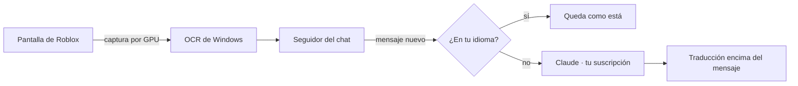

# Guía de Bubble 2.0

Todo lo que no entra en la portada: instalación paso a paso, cómo se usa cada parte, la configuración y cómo está
hecho por dentro.

- [Instalación](#instalación)
- [Primer uso](#primer-uso)
- [La ventana](#la-ventana)
- [Leer el chat y las burbujas](#leer-el-chat-y-las-burbujas)
- [Escribir en otro idioma](#escribir-en-otro-idioma)
- [Voz](#voz)
- [Jerga, dialectos y tono](#jerga-dialectos-y-tono)
- [Configuración](#configuración)
- [Cómo está hecho](#cómo-está-hecho)
- [Probarlo sin Roblox](#probarlo-sin-roblox)
- [Si algo no anda](#si-algo-no-anda)

---

## Instalación

**Necesitás:**

- Windows 10 u 11.
- Python 3.12 o más nuevo.
- Claude Code con sesión iniciada en tu suscripción de Claude. Sirve la extensión de VS Code, o
  `irm https://claude.ai/install.ps1 | iex` y después `claude` una vez para iniciar sesión.

```powershell
python -m venv .venv
.venv\Scripts\python.exe -m pip install -e ".[voz]"
```

`[voz]` suma la voz (subtítulos y tu voz traducida). Sin eso, Bubble traduce el chat, las burbujas y lo que
escribís; para correr los tests, `".[voz,dev]"`.

Para abrirlo: `Iniciar.bat`, o el acceso directo **Bubble** que se crea solo en el escritorio.

## Primer uso

La primera vez aparece un tutorial corto. Se puede saltar, y se reabre desde **Ajustes → Ver el tutorial**.

1. Abrí Bubble. Arriba dice **Listo** cuando ya está conectado con tu suscripción de Claude (unos segundos).
2. Abrí Roblox, en ventana o en pantalla completa.
3. **Apagá la traducción automática de Roblox.** Si no, Bubble lee mensajes ya traducidos por Roblox y se pierde la
   jerga original. Adentro del juego: **Esc** → **Configuración** → desactivá **Traducción automática del chat**.
4. **El chat se encuentra solo.** Con un par de mensajes a la vista, Bubble ubica el chat del juego. Si en algún
   juego no lo encuentra: **Ajustes → Buscar el chat**, o **Marcarlo a mano** (arrastrás un rectángulo sobre los
   mensajes).
5. **Ajustes → Probar lectura** muestra en **Actividad** lo que leyó y qué mensajes reconoció, y guarda imágenes en
   `%LOCALAPPDATA%\Bubble\debug` (entre ellas una vista con las traducciones encima: las traducciones no salen en
   las capturas de pantalla, a propósito, así Bubble no se lee a sí mismo).

## La ventana

Cinco páginas, arriba:

- **Inicio:** en qué idioma hablás y cuatro interruptores: el chat, las burbujas, lo que te dicen por voz y tu voz
  para los demás. Y la tecla para escribir.
- **Voz:** en qué idioma te escuchan, cómo se traduce tu voz (con botón o directo), cómo suena (femenina o
  masculina, velocidad) y el micrófono.
- **Pruebas:** tu micrófono (bien, normal o mal), tu voz traducida, chat a voz, lo que te dicen y tu PC, sin jugar.
  Y lo que Bubble aprendió de tu forma de hablar (ver [Pruebas](#pruebas)).
- **Ajustes:** todo lo personalizable:
  - el tema de la ventana (oscuro o claro);
  - cómo se ven las traducciones en el juego: el fondo (grafito, medianoche, violeta, bosque o negro), el detalle de
    color, la opacidad y el tamaño de la letra, con una vista previa;
  - los subtítulos de voz: tamaño, arriba o abajo, y si se ve lo que dijeron en su idioma;
  - al escribir: en qué idioma mandar y con qué tono;
  - el chat de Roblox (buscarlo, marcarlo a mano, probar la lectura) y el rendimiento.
- **Actividad:** todo lo que se fue traduciendo, y un lugar para probar sin Roblox.

Al abrir aparece un cartelito con el logo y, en un par de segundos, la ventana completa.

## Leer el chat y las burbujas

**El chat:**

- Cada mensaje en otro idioma se traduce **encima de sí mismo**. El nombre del jugador queda visible, y los
  mensajes en tu idioma quedan como están.
- La traducción aparece de una vez, terminada (~2 s después del mensaje). Si en un mensaje de dos renglones la
  traducción es corta, se reparte entre los dos: nunca queda un renglón tapado y vacío.
- Si el OCR lee un mensaje roto (letras mezcladas), espera a leerlo bien antes de traducirlo.
- Solo se traducen los **mensajes nuevos**: si subís en el chat, lo viejo no se toca.
- Cuando llega un mensaje y el chat sube, las traducciones suben con él al instante.
- Los avisos del juego (`[SYSTEM]`, "has joined the game", "(+25)") y el spam no se traducen.
- Si cerrás el chat o salís de Roblox, las traducciones se ocultan.

**Las burbujas** sobre la cabeza de los jugadores:

- Se detectan varias veces por segundo y la traducción las sigue con la cámara.
- La traducción aparece ~1 s después de que aparece la burbuja (leerla tarda ~0,05 s; el resto es Claude). Va por
  el carril rápido (Haiku), sin esperar detrás del chat; y si el mismo mensaje también está en el chat, se traduce una
  sola vez para los dos. Antes tardaba ~2,2 s o más (esperaba 0,6 s por si llegaba por el chat y hacía fila).
- Las burbujas apiladas del mismo jugador se separan.
- Si una burbuja pasa por detrás del chat, su traducción queda tapada igual que el original.
- Si la traducción es más larga que el original, la burbuja crece en vez de cortar el texto.
- Se apagan con el interruptor **Burbujas**, en Inicio.

**En tus capturas:** las traducciones salen cuando sacás una captura con **Impr Pant**, **Win + Shift + S** o
**Win + Impr Pant** (para mandar ejemplos). El resto del tiempo son invisibles para las capturas: así Bubble lee el
chat original que queda debajo. Mientras sacás la captura deja de leer un momento. La Xbox Game Bar
(Win + Alt + Impr Pant) y las grabaciones o transmisiones (OBS, Discord) no las muestran. Se apaga en
**Ajustes → Traducciones en el juego**.

## Escribir en otro idioma

En el juego apretá el atajo (**°** por defecto) y se abre una barra para escribir:

- **Escribí como hablás vos.** Mientras escribís ves cómo va a quedar la traducción, en celeste, debajo. Las
  traducciones del chat, de las burbujas y los subtítulos siguen a la vista mientras escribís.
- **Enter:** lo traduce y lo manda al chat de Roblox. Bubble solo hace tres cosas: abre el chat con su tecla,
  escribe el mensaje y aprieta Enter. No toca ninguna otra tecla. (Con teclados en español esa tecla también
  escribe «}» en la barra del chat: Bubble lo borra antes de escribir.)
- **Ctrl+Enter:** lo dice en voz en vez de mandarlo al chat (ver [Voz](#voz)).
- **Tab** cambia el idioma (el chip de la izquierda: EN, PT…), **↑ ↓** el tono (los puntitos de la derecha: más
  llenos, más informal) y **Esc** cierra. Si la reabrís enseguida, lo que escribiste sigue ahí.
- Si el atajo lleva Shift (como «°»), podés apretar **la misma tecla sola**. En Roblox el Shift activa el Shift
  Lock y mueve la cámara.
- El atajo solo funciona con Roblox al frente; en otros programas la tecla escribe normalmente.
- Para cambiarlo: **Cambiar**, en Inicio, y apretá la tecla o el botón del mouse que quieras.

**Un solo idioma para todo.** El idioma del chip es el mismo para el chat, para Ctrl+Enter y para tu voz: si
cambiás a inglés con Tab, tu voz también sale en inglés. Y se mantiene: la próxima vez que abrís la barra (o hablás)
sigue en ese. En automático, la primera vez se elige el que más se usa en el chat; después, el último que usaste.
También se elige en **Ajustes → Al escribir** o en **Voz → Te escuchan en**. Si el servidor mezcla idiomas, la
opción **Todos los del chat** manda el mensaje en varios a la vez (tu voz usa el principal).

## Voz

Todo el audio se procesa en tu PC: Whisper entiende la voz, un modelo chico reconoce quién habla y Piper habla. Los
tres son locales. Claude solo traduce el texto. Hace falta instalar la parte de voz (`".[voz]"`, ver
[Instalación](#instalación)).

La primera vez se descargan el reconocimiento de voz (hasta ~500 MB, según tu PC), el de voces (~30 MB) y cada voz
que se use (~60 MB). Quedan en `%LOCALAPPDATA%\Bubble\models`.

**Subtítulos de lo que te dicen.** Interruptor **Lo que te dicen por voz**, en Inicio.

- Mientras la persona habla ya ves lo que va diciendo, en gris (aparece ~0,5 s después de que empieza).
- Apenas hace una pausa se pide la traducción, que llega palabra por palabra y reemplaza al gris, en blanco.
  Tarda ~2 s desde que termina de hablar; casi todo es lo que tarda Claude.
- Cada persona tiene su color y su número (**Voz 1**, **Voz 2**…) y Bubble la reconoce cuando vuelve a hablar. No
  sabe su nombre de Roblox: la numera en el orden en que aparece.
- Lo que ya está en tu idioma no se subtitula ni se traduce. Whisper a veces confunde el español rioplatense con
  portugués o italiano: además de lo que dice Whisper se miran las palabras, y si igual llegara a Claude y volviera
  igual, no se muestra.
- Se nota **cómo lo dijeron**: si la voz subió al final (pregunta), si gritaron o exclamaron (comparado con cómo habla
  esa voz normalmente). Whisper no marca nada de eso; Bubble lo mide en el audio y se lo avisa a Claude, así la
  traducción tiene los ¿? y ¡! y la emoción que corresponden.

Se escucha **solo el sonido de Roblox** (Windows 11): Discord, un video o la música no se subtitulan, aunque suenen
fuerte. Si Roblox se reabre o pasás a otro juego (cambia de proceso), Bubble lo sigue solo. En Windows más viejos se
escucha todo lo que suena en la PC.

**Tu voz, traducida.** Interruptor **Tu voz para los demás**, en Inicio. En la página **Voz** elegís cómo:

- **Con un botón** (por defecto el **botón lateral del mouse, adelante**):
  - **tocalo y hablá:** cuando terminás de hablar, se traduce y se dice solo (o tocalo otra vez para terminar);
  - o **mantenelo apretado** mientras hablás y soltalo.
- **Directo, sin botón:** hablás normal. Cada frase que decís sale traducida en voz ~2 s después de que terminás.
  Ojo: traduce todo lo que diga tu micrófono.
- **Escribiendo:** en la barra para escribir, **Ctrl+Enter** en vez de Enter.

**Te escuchan en** (en la página **Voz**) es el idioma de tu voz: el mismo que el de la barra para escribir.

**Tus pausas.** Apenas hacés una pausa, Bubble lee lo que dijiste. Si suena terminado, lo traduce ya (sin esperar
más silencio ni volver a leerlo); si quedó a medias ("fui a buscar la espada y…", "porque…"), espera a que sigas.
Así no te corta a mitad de frase y, cuando terminás, sale enseguida.

**Preguntas, gritos y emociones.** En español "¿vamos a la torre?" y "vamos a la torre" tienen las mismas palabras:
lo que cambia es la entonación. Bubble mide en tu voz si subió al final (pregunta), si gritaste o exclamaste
(comparado con cómo hablás normalmente, que va aprendiendo) o si hablaste bajito, y se lo pasa a Claude. La voz
sintética lo acompaña: más rápida y fuerte si gritaste, más suave si hablaste bajito.

**Aprende tu forma de hablar.** Cuanto más lo usás, mejor te entiende y más rápido traduce:

- Whisper recibe un ejemplo fijo y corto de cómo se habla (voseo, jerga de juego, con ¿? y ¡!): entiende mejor y
  pone los signos. Nada más: con listas de palabras o frases aprendidas, en frases cortas ("hola") inventaba o
  repetía ("Hola Hola Hola"). Si alguna vez copia el ejemplo en vez de escucharte, se da cuenta y vuelve a leer.
- Tus palabras y nombres (de tus amigos, tu jerga, lo que Whisper no te entendía) se los pasa a **Claude**: así
  entiende qué quisiste decir aunque Whisper haya escuchado otra cosa parecida.
- Solo aprende lo seguro: nada con palabras repetidas ni cosas que no son palabras. Lo que se había aprendido mal
  antes se limpia solo.
- Lo que ya dijiste queda guardado: si volvés a decir lo mismo ("dale, esperame"), sale al instante.
- En **Pruebas** corregís lo que entendió o cómo lo tradujo: Claude usa esas traducciones de modelo para sonar como
  vos querés.
- Si querés ir más rápido: **Pruebas → Entrenar tu voz** (opcional, ~5 minutos) le enseña tu vocabulario, tus
  expresiones, cómo preguntás y cómo gritás de una vez.

Todo queda en `%LOCALAPPDATA%\Bubble\perfil_voz.json` (solo en tu PC); se borra desde **Pruebas**.

Lo que se va a decir en voz se traduce como se habla (palabras completas, sin "vc" ni "kkkk", y en la escritura del
idioma: el hindi, en devanagari), para que la voz no lea abreviaturas letra por letra.

**Cómo suena:** voz **femenina** o **masculina** (elegidas a mano para cada idioma; si un idioma tiene una sola, se
usa esa), **velocidad** y **Probar voz**. Con **Escucharla yo también**, tu voz traducida suena en tus auriculares,
más bajo, así sabés qué dijo. Hay voz para español, inglés, portugués, francés, alemán, italiano, ruso, polaco,
neerlandés, chino, hindi, turco, árabe, coreano, indonesio y vietnamita.

**Que te escuchen los demás (como Soundpad).** Windows no deja que un programa hable "por tu micrófono": hace falta
un micrófono virtual. Bubble usa **VB-Audio Virtual Cable**, gratis (es el "driver" que se descarga):

1. En **Voz → Micrófono**, tocá **Instalar (gratis)**. Windows pide permiso de administrador; en el instalador
   tocá **Install Driver**. Si te lo pide, reiniciá la PC.
2. Abrí Bubble. El instalador suele dejar el cable como micrófono o parlante de Windows (dejás de escuchar, o
   Discord deja de escucharte): Bubble lo vuelve a dejar como estaba, solo.
3. Listo, no hay que configurar nada más.

Mientras Bubble está abierto, el micrófono de Windows es el virtual y Bubble le pasa tu micrófono real en vivo: te
escuchan igual que siempre y, cuando suena tu voz traducida (con el botón, en modo directo o con Ctrl+Enter), tu voz
baja. Al cerrar Bubble, Windows vuelve a tu micrófono (y si Bubble se cerró de golpe, lo arregla al abrirse). Si
algo queda raro, **Voz → Arreglar Windows**.

**Abrí Bubble antes que Roblox.** Roblox arma su lista de micrófonos una sola vez, al abrirse, y usa el que en ese
momento es el de Windows (se ve en su registro). Bubble pone el micrófono virtual apenas abre (sin esperar a
conectarse) y no lo saca aunque cierres Roblox: el próximo Roblox lo toma solo. Si Roblox ya estaba abierto, Bubble
se da cuenta (mira de qué micrófono está grabando Roblox) y te avisa en la ventana y en el juego: elegí **CABLE
Output** en Roblox (**Esc → Configuración → Dispositivo de entrada**) o volvé a abrir Roblox.

- Con **Pasar también mi voz real** apagado, solo escuchan la voz traducida.
- Discord usa el micrófono de Windows: mientras está prendido, también escucha la voz traducida. Si no querés, en
  Discord elegí tu micrófono de verdad en vez de "Predeterminado".
- ¿Por qué no como Soundpad? Soundpad se mete dentro de cada programa para hablar por su micrófono. Con Roblox eso
  choca con su anti-trampas y puede traer problemas; el micrófono virtual no toca Roblox.

**Tu micrófono en Roblox tiene que estar activado** (el de arriba a la izquierda, sin la raya roja): si estás
muteado, no te escucha nadie. Bubble no lo prende ni lo apaga; si hablás estando muteado, la página **Voz** te avisa.

Sin el micrófono virtual, la página **Voz** te avisa: tu voz traducida suena solo en tus auriculares.

El chat de voz de Roblox pide verificación de edad. Usar voz sintética puede ir contra sus reglas en algunos
casos: usala con cuidado, para comunicarte.

**Cómo es tan rápido.** Whisper se entrenó con ventanas de 30 s y, de la forma normal, procesa siempre 30 s aunque la
frase dure 2. Bubble le pasa la frase completada con silencio hasta 3 s: tarda muchas veces menos. Mientras alguien
habla usa un modelo rápido (`base`) y para el texto final uno más preciso (`small`); en inglés alcanza con el rápido.
En procesadores chicos se usan modelos más livianos solos.

Con menos de 3 s ("hola", "dale" solos), el modelo no sabía dónde terminaba la frase: repetía ("Dale Dale") o
inventaba. Completándola a 3 s, en las mismas frases de prueba (voces de Windows en español) pasó de 39 % a 10 % de
palabras mal entendidas en frases cortas, y de 11 % a 8 % en largas, sin tardar más. Los modelos grandes
(`large-v3-turbo`) así recortados repiten las palabras cortas ("Hola Hola Hola") y tardan 2 s: se probaron y no se
usan. Si igual quedara todo repetido ("Dale. Dale. Dale."), se deja una vez. Con tu micrófono, el ruido que Whisper
convierte en texto (una tecla, un golpe → "y", "¡Vamos!") se reconoce y se descarta.

La voz y las burbujas tienen **su propio carril con Claude**: una sesión aparte (no espera detrás de las traducciones
del chat), con **Haiku** y sin "pensar" antes de responder. Medido: tu voz se traduce en ~0,75 s (con Opus ~1,9 s) y
los subtítulos en ~1 s (con Opus ~1,6 s), casi con la misma calidad; el chat escrito sigue con Opus, que traduce mejor
la jerga. Si alguna vez tarda de más, se le pregunta también al carril del chat y gana el primero. Desde que terminás
de hablar hasta que suena tu voz traducida:

| | Al principio | Ahora |
|---|---|---|
| Saber que terminaste | 0,8 s | 0,2 s (y lo leído ya sirve) |
| Entender tu voz | 0,9 s | 0,4 a 0,7 s |
| Traducir | 2,6 s (a veces 15 s o nada) | 0,8 a 1,2 s |
| Armar la voz | 0,4 s | 0,2 a 0,4 s |
| **Total** | **~4,7 s** | **~2 s** |

**Inglés rápido.** Con gente que habla muy rápido y se pisa (una pelea, por ejemplo), el reconocimiento que entra en
tu PC se equivoca bastante: en una grabación real así, 66 % de palabras mal (medido). Se probaron cortes más cortos,
más hipótesis y modelos más grandes: nada mejora sin volverse lento (el grande con la ventana completa baja a 50 %
pero tarda 6 veces más de lo que dura el audio). La alternativa en estudio son los **Subtítulos en vivo de Windows**
(Win + Ctrl + L), que están hechos para eso.

**Probarlo sin Roblox.** El laboratorio de voz arma conversaciones con voces sintéticas (una persona, gente
hablando rápido, un grupo que se pisa, siete idiomas, música y explosiones de fondo, un monólogo largo) y mide
cuánto tarda y cuánto entiende:

```powershell
.venv\Scripts\python.exe -m bubble.tools.voice_lab --sin-claude   # solo escuchar (gratis)
.venv\Scripts\python.exe -m bubble.tools.voice_lab                # con traducción
.venv\Scripts\python.exe -m bubble.tools.voice_lab --directo       # tu voz, traducción directa
```

## Pruebas

La página **Pruebas** sirve para probar todo sin jugar. Todo suena solo en tus auriculares: nada le llega a Roblox.

- **Tu micrófono:** leés una frase y te dice si va a andar **bien, normal o mal** para traducir tu voz. Mide el
  volumen de tu voz, el ruido de fondo, si satura y cuántas palabras entendió, y te dice qué cambiar (subir el
  volumen, acercarlo, alejarlo del ventilador…).
- **Tu voz traducida:** tocás **Hablar**, decís algo como en el juego y ves qué entendió, cómo lo dijiste
  (pregunta, gritando…), cómo lo tradujo y cuánto tardó cada paso; y la escuchás. Si algo salió mal, lo corregís y
  tocás **Guardar**: aprende tus palabras y cómo querés sonar.
- **Chat a voz:** como Ctrl+Enter: escribís y escuchás cómo lo dice.
- **Lo que te dicen:** una voz sintética dice una frase en inglés, como otro jugador, y ves el subtítulo.
- **Tu PC:** tu procesador, memoria y placa de video, cuánto tarda de verdad en esta PC entender una frase y armar la
  voz, y cuánto va a tardar tu voz traducida. Te dice si anda excelente, bien, normal o lenta, y qué ajustar.
- **Entrenar tu voz (opcional):** unos 5 minutos, en una ventana aparte, en dos partes:
  1. **Leé en voz alta** 28 frases como las de una partida: voseo, jerga de juego ("pvp", "tradear", "farmear",
     "lag"), nombres de juegos, preguntas, exclamaciones y dos gritos. Después de cada una te dice qué entendió; las
     palabras que no te entendió pasan a tu vocabulario (Claude las usa para entenderte), y si salió bien pasa sola a
     la siguiente. Tus grabaciones quedan en tu PC (`%LOCALAPPDATA%\Bubble\tu_voz`), para poder medir cómo te
     entiende con tu voz real.
  2. **Con tus palabras:** te pregunta cómo saludás, qué decís cuando ganás o perdés, cómo pedís ayuda o proponés un
     intercambio, los nombres de tus amigos y juegos, y las expresiones que más usás. Contestás como hablás, corregís
     lo que entendió si hace falta y tocás **Guardar**: queda como tu vocabulario.

  Además aprende tu voz de siempre, **cuánto sube tu voz cuando preguntás** y **cómo suena tu grito**: cada uno
  pregunta y grita distinto, y desde ahí los umbrales son los tuyos. Cortás cuando quieras (**Terminar por ahora**)
  y la próxima vez seguís desde la misma frase. Está en español y en inglés (según tu idioma).
- **Lo que aprendió:** cuántas frases y palabras tuyas conoce, cuántas traducciones aprobaste, cuántas salen al
  instante, los tiempos promedio de tu voz y lo que sacó del entrenamiento. **Borrar lo aprendido** empieza de cero.

## Jerga, dialectos y tono

**Lo que te llega:**

- Tu idioma incluye **tu variante** (por defecto la de Windows, por ejemplo `es-AR`). Lo que te llega se traduce a
  cómo hablás vos: "vlw mano, tmj kkkk" → "¡gracias, bro, sos un crack! jajaja".
- Si alguien escribe en tu idioma pero con jerga de otro país ("no mames wey, neta"), se adapta a tu variante.
- Las risas se convierten al instante, sin llamar a Claude (kkkk, wkwk, ㅋㅋㅋ, mdr → jajaja).
- Las palabras de juego que se usan en todos los idiomas ("pvp", "lag", "noob", "loot", "farmear", "tradear",
  "lobby"…) no dicen nada del idioma: "vamos a hacer pvp" o "tengo lag" son español y no se traducen, y "gg noob"
  se entiende igual en cualquier idioma.
- Si una expresión no tiene equivalente, se aclara breve entre paréntesis ("skill issue: problema tuyo").

**Lo que escribís:**

- Se interpreta con tu jerga y sale como lo diría un jugador del otro idioma: "che boludo, posta que está re
  zarpado, ahre" → "yo bro, fr that's insane lol jk".

El diccionario de jerga por idioma y país está en
[src/bubble/translate/slang.py](../src/bubble/translate/slang.py).

**Tono de lo que enviás.** Solo cambia *cómo* se dice, nunca *qué* se dice. Ejemplo con "che boludo, posta que ese
pet está re zarpado, me lo cambiás? ahre":

| Nivel | Inglés |
|---|---|
| 1 · Neutro | Hey, seriously, that pet is really awesome. Would you trade it to me? Just kidding. |
| 3 · Casual | hey dude, for real that pet is super sick, wanna trade it to me? lol |
| 5 · Jerga nativa | yo bro ngl that pet is lowkey insane fr, trade me it? jk lol |

## Configuración

Copiá [config.example.toml](../config.example.toml) a `%APPDATA%\Bubble\config.toml`. Lo más útil:

| Opción | Para qué |
|---|---|
| `[user] language` | Tu idioma y variante (`auto` = el de Windows) |
| `[user] tone` | Tono de lo que enviás, de 1 a 5 |
| `[roblox] username` | Tu nombre en Roblox: tus mensajes no se traducen |
| `[roblox] hotkey` | El atajo para escribir |
| `[roblox] performance` | `auto`, `alta`, `media` o `baja` |
| `[roblox] gpu_capture` | Capturar la pantalla con la placa de video |
| `[claude] model` | `opus` por defecto (el más preciso en las pruebas) |
| `[voice] gender`, `speed` | Cómo suena tu voz traducida |
| `[voice] mic` | Tu micrófono (vacío = el predeterminado de Windows) |
| `[appearance] theme` | `oscuro` o `claro` |
| `[appearance] pill_color`, `accent`, `pill_opacity`, `text_scale` | Cómo se ven las traducciones |
| `[appearance] in_screenshots` | Que las traducciones salgan en tus capturas |

Casi todo esto se cambia más fácil desde la ventana (Ajustes y Voz).

## Cómo está hecho



**Leer bien:**

- El chat se prepara como letras negras sobre blanco, sea cual sea el fondo del juego. Lee el 99 % de las líneas,
  también con fondos claros como nieve.
- Cuando el fondo del chat se desvanece, se suma una segunda lectura, y lo que salió solo en esa se confirma
  antes de traducirlo.
- Si una lectura queda incompleta, se repite: con la cámara moviéndose, la siguiente suele salir bien.

**No repetir ni perder mensajes:**

- El chat se sigue como una **secuencia ordenada**, no como textos sueltos:
  - un mensaje repetido abajo es nuevo;
  - uno que el OCR salteó y aparece entre dos conocidos también;
  - lo que aparece arriba es historial.

**Velocidad:**

- Sesiones de Claude persistentes (3 a la vez), sin herramientas ni configuración del usuario: solo traducen.
- El idioma se detecta localmente (lingua): si el mensaje ya está en tu idioma, no se llama a Claude.
- Frases universales ("gg", "xd", emojis) y un caché de frases cortas responden al instante.
- Si una sesión de Claude se cuelga, se reintenta con otra a los 5 s.

**Se adapta a la PC:**

- Captura por GPU (DXGI, cualquier placa): en 1080p baja de ~50 ms a ~3 ms.
- Un ritmo adaptativo mide cuánto cuesta cada lectura y la espacia según el procesador, para no quitarle
  rendimiento a Roblox.

**Seguro:** Bubble nunca toca el proceso de Roblox. Solo mira la pantalla (como un programa de grabación), muestra
ventanas propias y escribe como lo harías vos.

```
src/bubble/
  capture/      pantalla, OCR, detección del chat, seguidor del chat, burbujas
  translate/    motor, Claude, prompt y jerga, caché, detección de idioma
  ui/           ventana, traducciones sobre el juego, barra para escribir, tutorial
  performance.py  CPU y GPU: ritmo adaptativo
  win32.py      ventanas, teclado, atajos
  tools/        simulador de Roblox y pruebas en tiempo real
tests/          tests con proveedores falsos (no gastan tu suscripción)
```

## Probarlo sin Roblox

**Con tus grabaciones de Roblox.** El grabador de Roblox (Esc → Grabar) guarda el juego sin las traducciones encima.
Bubble puede "jugar" ese video a su velocidad real, con el mismo código que usa en el juego, y medir cómo le fue:

```powershell
python -m bubble.tools.recording_lab chat     "$env:USERPROFILE\Videos\Roblox\Roblox-....mp4"
python -m bubble.tools.recording_lab burbujas "$env:USERPROFILE\Videos\Roblox\Roblox-....mp4"
python -m bubble.tools.recording_lab voz      "$env:USERPROFILE\Videos\Roblox\Roblox-....mp4" --referencia ref.json
```

- **chat:** mensajes encontrados (con `--esperados`, una lista de los que había de verdad), repetidos o basura,
  traducciones fuera del chat y parpadeos.
- **burbujas:** cuántas burbujas tienen su traducción, cuántas quedan fuera de lugar y cada texto que se leyó (así se
  ve si alguno salió cortado).
- **voz:** lo que entendió de cada frase, cuánto tarda y, con una transcripción de referencia, cuántas palabras
  entendió mal.

Guarda cómo se vería en `%LOCALAPPDATA%\Bubble\recording_lab`. Las grabaciones tienen nombres de otros jugadores: no
se suben a ningún lado.

**Con el simulador.**

```powershell
python -m bubble.tools.realtime_benchmark lento medio rapido rafagas
```

Abre un **simulador de Roblox** y la app real, y mide todo. El simulador tiene chat con banderitas, nombres de
colores, avisos del sistema, spam, fondo que se desvanece, burbujas que se apilan y cámara en movimiento. Se mide:

- mensajes detectados y perdidos;
- demoras de detección y de traducción;
- parpadeos;
- costo y uso de CPU;
- cuánto tardan las traducciones en acomodarse.

Otros escenarios:

- `lento_transparente`: el chat sin fondo.
- `detectar`: la app encuentra el chat sola.
- `envio`: escribe y manda mensajes, y verifica que ninguna otra tecla le llegue al juego.

Cada 3 s guarda una imagen de lo que ve el jugador en `%LOCALAPPDATA%\Bubble\benchmark\`.

**Laboratorio del chat, sin pantalla y sin gastar:**

```powershell
python -m bubble.tools.chat_lab medio_transparente rafagas_transparente medio rafagas
```

Corre el ciclo real de lectura (captura, OCR, seguidor del chat, píldoras) contra el simulador dibujado en memoria,
con traducciones falsas instantáneas. Como sabe dónde está cada mensaje en cada momento, mide parpadeos,
píldoras fuera de lugar, mensajes sin tapar y basura. Tarda un minuto por escenario.

**Otras herramientas:**

- `python -m pytest` corre los tests.
- `python -m bubble.tools.voice_lab` es el laboratorio de voz (ver [Voz](#voz)).
- `python -m bubble.tools.bench_latency --models opus sonnet` mide la latencia por modelo.
- `python -m bubble --console` traduce por consola (`Nombre: mensaje`, o `> lo que escribís`).

## Si algo no anda

Bubble anota lo que va haciendo en `%APPDATA%\Bubble\bubble.log` (cuándo se sacó una captura, si escucha solo a
Roblox, qué pasó con tu voz traducida…) y los errores en `errores.log`. No anota lo que dicen en el chat ni lo que tecleás. Si algo
falla, esos dos archivos dicen por qué.


- **No encuentra el chat:** esperá a que haya dos o tres mensajes a la vista y tocá **Ajustes → Buscar el chat**,
  o **Marcarlo a mano**.
- **Las traducciones no aparecen:** Roblox tiene que estar al frente y sin otras ventanas encima del chat.
- **El mensaje no se envía:** el chat de Roblox se abre con la tecla física "/" (en un teclado latinoamericano es
  la tecla "-"). Si el juego usa otra, cambiá `open_chat_key`.
- **Ves mensajes ya traducidos por Roblox:** volvé a apagar su traducción automática (a veces se reactiva).
- **Los demás no escuchan tu voz traducida:** hace falta el micrófono virtual (**Voz → Micrófono**) y, en Roblox,
  elegir **CABLE Output** como micrófono.
- **Bubble se cerró de golpe:** los errores quedan en `%APPDATA%\Bubble\errores.log`. Si se cerró mientras
  preparaba la voz, la próxima vez abre con la voz en pausa.
