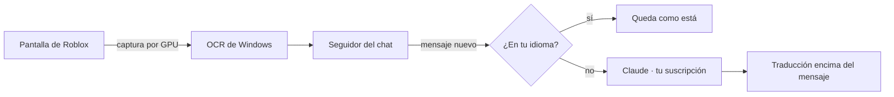

# Guía de Bubble 1.0

Todo lo que no entra en la portada: instalación paso a paso, cómo se usa cada parte, la configuración y cómo está
hecho por dentro.

- [Instalación](#instalación)
- [Primer uso](#primer-uso)
- [Leer el chat y las burbujas](#leer-el-chat-y-las-burbujas)
- [Escribir en otro idioma](#escribir-en-otro-idioma)
- [Voz (beta 2.0)](#voz-beta-20)
- [Jerga, dialectos y tono](#jerga-dialectos-y-tono)
- [Configuración](#configuración)
- [Cómo está hecho](#cómo-está-hecho)
- [Probarlo sin Roblox](#probarlo-sin-roblox)
- [Si algo no anda](#si-algo-no-anda)

---

## Instalación

**Necesitás:**

- Windows 10 u 11.
- Python 3.12 o más nuevo.
- Claude Code con sesión iniciada en tu suscripción de Claude. Sirve la extensión de VS Code, o
  `irm https://claude.ai/install.ps1 | iex` y después `claude` una vez para iniciar sesión.

```powershell
python -m venv .venv
.venv\Scripts\python.exe -m pip install -e ".[dev]"
```

Para abrirlo: `Iniciar.bat`, o el acceso directo **Bubble** que se crea solo en el escritorio.

## Primer uso

La primera vez aparece un tutorial corto. Se puede saltar, y se reabre con el botón **Tutorial**.

1. Abrí Bubble y esperá a que diga **Listo**.
2. Abrí Roblox en ventana o en pantalla completa. La ventana de Bubble tiene que decir **Roblox detectado**.
3. **Apagá la traducción automática de Roblox.** Si no, Bubble lee mensajes ya traducidos por Roblox y se pierde la
   jerga original. Adentro del juego: **Esc** → **Configuración** → desactivá **Traducción automática del chat**.
4. **El chat se encuentra solo.** Con un par de mensajes a la vista, Bubble ubica el chat del juego. Si cambiás de
   juego y el chat está en otro lugar, tocá **Detectar chat**. Si aun así no lo encuentra, tocá **a mano…** y
   arrastrá un rectángulo sobre los mensajes.
5. **Probar captura** muestra lo que leyó y qué mensajes reconoció. Guarda imágenes en
   `%LOCALAPPDATA%\Bubble\debug`, entre ellas una vista con las traducciones encima. Las traducciones no salen en
   las capturas de pantalla a propósito: así Bubble no se lee a sí mismo.

## Leer el chat y las burbujas

**El chat:**

- Cada mensaje en otro idioma se traduce **encima de sí mismo**. El nombre del jugador queda visible, y los
  mensajes en tu idioma quedan como están.
- Mientras se traduce, el mensaje queda "seleccionado" con el original en gris.
- Solo se traducen los **mensajes nuevos**: si subís en el chat, lo viejo no se toca.
- Cuando llega un mensaje y el chat sube, las traducciones suben con él al instante.
- Los avisos del juego (`[SYSTEM]`, "has joined the game", "(+25)") y el spam no se traducen.
- Si cerrás el chat o salís de Roblox, las traducciones se ocultan.

**Las burbujas** sobre la cabeza de los jugadores:

- Se detectan varias veces por segundo y la traducción las sigue con la cámara.
- Las burbujas apiladas del mismo jugador se separan.
- Si una burbuja pasa por detrás del chat, su traducción queda tapada igual que el original.
- Si la traducción es más larga que el original, la burbuja crece en vez de cortar el texto.
- Se apagan con la casilla del panel.

## Escribir en otro idioma

En el juego apretá el atajo (**°** por defecto) y se abre una barra para escribir:

- **Escribí como hablás vos.** Mientras escribís ves cómo va a quedar la traducción, en celeste, debajo.
- **Enter:** lo traduce y lo manda al chat de Roblox. Bubble solo hace tres cosas: abre el chat con su tecla,
  escribe el mensaje y aprieta Enter. No toca ninguna otra tecla. (Con teclados en español esa tecla también
  escribe «}» en la barra del chat: Bubble lo borra antes de escribir.)
- **Tab** cambia el idioma (el chip de la izquierda: EN, PT…), **↑ ↓** el tono (los puntitos de la derecha: más
  llenos, más informal) y **Esc** cierra. Si la reabrís enseguida, lo que escribiste sigue ahí.
- Si el atajo lleva Shift (como «°»), podés apretar **la misma tecla sola**. En Roblox el Shift activa el Shift
  Lock y mueve la cámara.
- El atajo solo funciona con Roblox al frente; en otros programas la tecla escribe normalmente.
- Para cambiarlo: **Cambiar…** en la ventana, y apretá la tecla o el botón del mouse que quieras.

El idioma de destino se elige solo: el que más se usa en el chat. Si el servidor mezcla idiomas, la opción
**Todos los del chat** manda el mensaje en varios a la vez.

## Voz (beta 2.0)

Todo el audio se procesa en tu PC: Whisper entiende la voz, un modelo chico reconoce quién habla y Piper habla. Los
tres son locales. Claude solo traduce el texto.

```powershell
.venv\Scripts\python.exe -m pip install -e ".[voz]"
```

La primera vez se descargan el reconocimiento de voz (hasta ~500 MB, según tu PC), el de voces (~30 MB) y una voz
por idioma (~60 MB). Quedan en `%LOCALAPPDATA%\Bubble\models`.

**Subtítulos de lo que te dicen.** Activá la casilla en la sección **Voz · beta**.

- Mientras la persona habla ya ves lo que va diciendo, en gris (aparece ~0,5 s después de que empieza).
- Apenas hace una pausa se pide la traducción, que llega palabra por palabra y reemplaza al gris, en blanco.
  Tarda ~2 s desde que termina de hablar; casi todo es lo que tarda Claude.
- Cada persona tiene su color y su número (**Voz 1**, **Voz 2**…) y Bubble la reconoce cuando vuelve a hablar. No
  sabe su nombre de Roblox: la numera en el orden en que aparece.
- Lo que ya está en tu idioma no se subtitula.

En esta beta se subtitula todo lo que suena en la PC. Si tenés Discord o un video abierto, también.

**Tu voz, traducida.** Activá **Traducir mi voz** y elegí cómo:

- **Mientras mantengo apretado:** apretás el botón (por defecto el **botón lateral del mouse, adelante**), hablás y
  lo soltás.
- **Directo:** hablás normal, sin botón. Cada frase que decís sale traducida en voz ~2 s después de que terminás.
  Ojo: traduce todo lo que diga tu micrófono.
- **Escribiendo:** en la barra para escribir, **Ctrl+Enter** en vez de Enter. Lo que escribiste se dice en voz en
  vez de mandarse al chat.

Con **Escucharla yo también**, tu voz traducida suena también en tus auriculares, más bajo, así sabés qué dijo.

Para que **los demás** lo escuchen, Roblox tiene que recibir esa voz como si fuera tu micrófono:

1. Instalá **VB-Audio Virtual Cable** (gratis): <https://vb-audio.com/Cable/>. Se instala como administrador y
   después hay que reiniciar Bubble.
2. En Roblox: **Configuración** → **Micrófono** → elegí **CABLE Output**.

Así, lo que sale por tu micrófono en Roblox es solo tu voz traducida. Sin el cable virtual, la voz traducida suena
por tus parlantes: sirve para probar.

El chat de voz de Roblox pide verificación de edad. Usar voz sintética puede ir contra sus reglas en algunos
casos: usala con cuidado, para comunicarte.

**Cómo es tan rápido.** Whisper se entrenó con ventanas de 30 s y, de la forma normal, procesa siempre 30 s aunque la
frase dure 2. Bubble le pasa solo la frase: tarda 10 a 40 veces menos. Mientras alguien habla usa un modelo rápido
(`base`) y para el texto final uno más preciso (`small`); en inglés alcanza con el rápido. En procesadores chicos
se usan modelos más livianos solos.

**Probarlo sin Roblox.** El laboratorio de voz arma conversaciones con voces sintéticas (una persona, gente
hablando rápido, un grupo que se pisa, siete idiomas, música y explosiones de fondo, un monólogo largo) y mide
cuánto tarda y cuánto entiende:

```powershell
.venv\Scripts\python.exe -m bubble.tools.voice_lab --sin-claude   # solo escuchar (gratis)
.venv\Scripts\python.exe -m bubble.tools.voice_lab                # con traducción
.venv\Scripts\python.exe -m bubble.tools.voice_lab --directo       # tu voz, traducción directa
```

## Jerga, dialectos y tono

**Lo que te llega:**

- Tu idioma incluye **tu variante** (por defecto la de Windows, por ejemplo `es-AR`). Lo que te llega se traduce a
  cómo hablás vos: "vlw mano, tmj kkkk" → "¡gracias, bro, sos un crack! jajaja".
- Si alguien escribe en tu idioma pero con jerga de otro país ("no mames wey, neta"), se adapta a tu variante.
- Las risas se convierten al instante, sin llamar a Claude (kkkk, wkwk, ㅋㅋㅋ, mdr → jajaja).
- Si una expresión no tiene equivalente, se aclara breve entre paréntesis ("skill issue: problema tuyo").

**Lo que escribís:**

- Se interpreta con tu jerga y sale como lo diría un jugador del otro idioma: "che boludo, posta que está re
  zarpado, ahre" → "yo bro, fr that's insane lol jk".

El diccionario de jerga por idioma y país está en
[src/bubble/translate/slang.py](../src/bubble/translate/slang.py).

**Tono de lo que enviás.** Solo cambia *cómo* se dice, nunca *qué* se dice. Ejemplo con "che boludo, posta que ese
pet está re zarpado, me lo cambiás? ahre":

| Nivel | Inglés |
|---|---|
| 1 · Neutro | Hey, seriously, that pet is really awesome. Would you trade it to me? Just kidding. |
| 3 · Casual | hey dude, for real that pet is super sick, wanna trade it to me? lol |
| 5 · Jerga nativa | yo bro ngl that pet is lowkey insane fr, trade me it? jk lol |

## Configuración

Copiá [config.example.toml](../config.example.toml) a `%APPDATA%\Bubble\config.toml`. Lo más útil:

| Opción | Para qué |
|---|---|
| `[user] language` | Tu idioma y variante (`auto` = el de Windows) |
| `[user] tone` | Tono de lo que enviás, de 1 a 5 |
| `[roblox] username` | Tu nombre en Roblox: tus mensajes no se traducen |
| `[roblox] hotkey` | El atajo para escribir |
| `[roblox] performance` | `auto`, `alta`, `media` o `baja` |
| `[roblox] gpu_capture` | Capturar la pantalla con la placa de video |
| `[claude] model` | `opus` por defecto (el más preciso en las pruebas) |

## Cómo está hecho



**Leer bien:**

- El chat se prepara como letras negras sobre blanco, sea cual sea el fondo del juego. Lee el 99 % de las líneas,
  también con fondos claros como nieve.
- Cuando el fondo del chat se desvanece, se suma una segunda lectura, y lo que salió solo en esa se confirma
  antes de traducirlo.
- Si una lectura queda incompleta, se repite: con la cámara moviéndose, la siguiente suele salir bien.

**No repetir ni perder mensajes:**

- El chat se sigue como una **secuencia ordenada**, no como textos sueltos:
  - un mensaje repetido abajo es nuevo;
  - uno que el OCR salteó y aparece entre dos conocidos también;
  - lo que aparece arriba es historial.

**Velocidad:**

- Sesiones de Claude persistentes (3 a la vez), sin herramientas ni configuración del usuario: solo traducen.
- El idioma se detecta localmente (lingua): si el mensaje ya está en tu idioma, no se llama a Claude.
- Frases universales ("gg", "xd", emojis) y un caché de frases cortas responden al instante.
- Si una sesión de Claude se cuelga, se reintenta con otra a los 5 s.

**Se adapta a la PC:**

- Captura por GPU (DXGI, cualquier placa): en 1080p baja de ~50 ms a ~3 ms.
- Un ritmo adaptativo mide cuánto cuesta cada lectura y la espacia según el procesador, para no quitarle
  rendimiento a Roblox.

**Seguro:** Bubble nunca toca el proceso de Roblox. Solo mira la pantalla (como un programa de grabación), muestra
ventanas propias y escribe como lo harías vos.

```
src/bubble/
  capture/      pantalla, OCR, detección del chat, seguidor del chat, burbujas
  translate/    motor, Claude, prompt y jerga, caché, detección de idioma
  ui/           ventana, traducciones sobre el juego, barra para escribir, tutorial
  performance.py  CPU y GPU: ritmo adaptativo
  win32.py      ventanas, teclado, atajos
  tools/        simulador de Roblox y pruebas en tiempo real
tests/          tests con proveedores falsos (no gastan tu suscripción)
```

## Probarlo sin Roblox

```powershell
python -m bubble.tools.realtime_benchmark lento medio rapido rafagas
```

Abre un **simulador de Roblox** y la app real, y mide todo. El simulador tiene chat con banderitas, nombres de
colores, avisos del sistema, spam, fondo que se desvanece, burbujas que se apilan y cámara en movimiento. Se mide:

- mensajes detectados y perdidos;
- demoras de detección y de traducción;
- parpadeos;
- costo y uso de CPU;
- cuánto tardan las traducciones en acomodarse.

Otros escenarios:

- `lento_transparente`: el chat sin fondo.
- `detectar`: la app encuentra el chat sola.
- `envio`: escribe y manda mensajes, y verifica que ninguna otra tecla le llegue al juego.

Cada 3 s guarda una imagen de lo que ve el jugador en `%LOCALAPPDATA%\Bubble\benchmark\`.

**Laboratorio del chat, sin pantalla y sin gastar:**

```powershell
python -m bubble.tools.chat_lab medio_transparente rafagas_transparente medio rafagas
```

Corre el ciclo real de lectura (captura, OCR, seguidor del chat, píldoras) contra el simulador dibujado en memoria,
con traducciones falsas instantáneas. Como sabe dónde está cada mensaje en cada momento, mide parpadeos,
píldoras fuera de lugar, mensajes sin tapar y basura. Tarda un minuto por escenario.

**Otras herramientas:**

- `python -m pytest` corre los tests.
- `python -m bubble.tools.voice_lab` es el laboratorio de voz (ver [Voz](#voz-beta-20)).
- `python -m bubble.tools.bench_latency --models opus sonnet` mide la latencia por modelo.
- `python -m bubble --console` traduce por consola (`Nombre: mensaje`, o `> lo que escribís`).

## Si algo no anda

- **No encuentra el chat:** esperá a que haya dos o tres mensajes a la vista y tocá **Detectar chat**, o marcalo
  **a mano…**.
- **Las traducciones no aparecen:** Roblox tiene que estar al frente y sin otras ventanas encima del chat.
- **El mensaje no se envía:** el chat de Roblox se abre con la tecla física "/" (en un teclado latinoamericano es
  la tecla "-"). Si el juego usa otra, cambiá `open_chat_key`.
- **Ves mensajes ya traducidos por Roblox:** volvé a apagar su traducción automática (a veces se reactiva).
