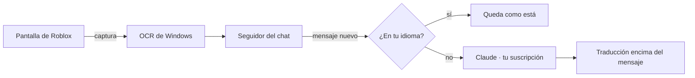

# Guía de Bubble

Esta guía reúne todo lo que no entra en la portada: la instalación, el uso de cada parte, la configuración y el
funcionamiento interno. No hace falta leerla de corrido; cada sección se puede consultar por separado.

- [Instalación y actualizaciones](#instalación-y-actualizaciones)
- [Primer uso](#primer-uso)
- [La ventana](#la-ventana)
- [Bubble en tu idioma](#bubble-en-tu-idioma)
- [Leer el chat y las burbujas](#leer-el-chat-y-las-burbujas)
- [Escribir en otro idioma](#escribir-en-otro-idioma)
- [Voz](#voz)
- [Pruebas](#pruebas)
- [Bubble Pro](#bubble-pro)
- [Jerga, dialectos y tono](#jerga-dialectos-y-tono)
- [Idiomas](#idiomas)
- [Configuración](#configuración)
- [Cómo está hecho](#cómo-está-hecho)
- [Probarlo sin Roblox](#probarlo-sin-roblox)
- [Soporte y Acerca de](#soporte-y-acerca-de)
- [Solución de problemas](#solución-de-problemas)

---

## Instalación y actualizaciones

> Si es tu primera vez, conviene seguir la [instalación en 5 pasos, con imágenes](INSTALACION.md).

**Doble clic en `Iniciar.bat`.** La primera vez se encarga de todo:

1. Busca **Python** (3.12 o posterior, de 64 bits). Si no encuentra una versión adecuada, ofrece instalarla.
2. Crea su propio entorno (`.venv`) con los paquetes necesarios.
3. Abre **Preparar Bubble**, que descarga el resto con una barra de progreso: el reconocimiento de voz (hasta unos
   330 MB), el reconocimiento de quién habla (unos 30 MB) y las voces en inglés (unos 120 MB). Mientras tanto, podés
   seguir usando la PC.
4. Lo que requiere tu permiso aparece con su propio botón: los componentes de Windows que falten, Claude Code, tu
   cuenta de Claude y el micrófono virtual.

Después queda un acceso directo **Bubble** en el escritorio. Cada vez que se abre, revisa en segundo plano que no falte
nada; si falta algo, vuelve a abrir **Preparar Bubble**. También se puede revisar desde **Ajustes → Revisar
instalación**.

Es compatible con el Roblox de la web (también con Bloxstrap) y con el de la Microsoft Store.

Para trabajar sobre el código: `python -m venv .venv` y `.venv\Scripts\python.exe -m pip install -e ".[voz,dev]"`.

**Actualizaciones.** Al abrirse, Bubble consulta en GitHub si hay una versión nueva (como máximo dos veces por día). Si
la hay, muestra las novedades y ofrece actualizar ahora o más tarde.

- **Ahora:** descarga la versión nueva, se cierra, reemplaza sus archivos y vuelve a abrir. Demora menos de un minuto.
  La configuración, la clave de Pro, lo aprendido de tu voz y los modelos se conservan. Si algo falla, se mantiene la
  versión anterior.
- **Más tarde:** no vuelve a preguntar hasta el día siguiente. Mientras tanto, queda el enlace **↑ Actualizar a la X**
  al final de la ventana.
- **Nunca durante una partida.** Si estás jugando, espera a que salgas del juego.
- **Actualizar automáticamente** (en Ajustes): con esta opción activada, Bubble no pregunta. Cada dos horas busca
  versiones nuevas, las descarga en segundo plano y las instala cuando no estás jugando ni usando Bubble. Si cerrás
  Bubble con una versión ya descargada, se instala al cerrar.
- Para buscar manualmente: **Ajustes → Buscar actualizaciones**.
- Una copia de desarrollo (con git) se actualiza con `git pull`, y solo si no tiene cambios sin guardar.

**Desinstalar:** **Ajustes → Desinstalar Bubble…** o `Desinstalar.bat`. Se puede elegir qué borrar: la configuración y
lo aprendido, los modelos y las voces (con el espacio que ocupan), el acceso directo, el micrófono virtual y la carpeta
de Bubble (una copia de desarrollo nunca se borra). Antes de borrar, Windows vuelve a usar tu micrófono y tu parlante
habituales.

## Primer uso

La primera vez te acompaña un tutorial breve. Se puede omitir y volver a ver desde **Ajustes → Ver el tutorial**.

1. Abrí Bubble. Cuando arriba aparece **Listo**, ya está conectado con tu cuenta de Claude.
2. Abrí Roblox, en ventana o en pantalla completa.
3. **Desactivá la traducción automática de Roblox** (Esc → Configuración → Traducción automática del chat). De lo
   contrario, Bubble lee mensajes ya traducidos por Roblox y se pierde la jerga original.
4. Con algunos mensajes a la vista, Bubble detecta el chat automáticamente. Si en algún juego no lo encuentra, usá
   **Ajustes → Buscar el chat** o **Marcarlo manualmente** (arrastrando un rectángulo sobre los mensajes).

Para ver qué está leyendo, **Ajustes → Probar lectura** lo muestra en **Actividad** y guarda imágenes en
`%LOCALAPPDATA%\Bubble\debug`.

## La ventana

La ventana tiene cinco páginas:

| Página | Contenido |
|---|---|
| **Inicio** | Tu idioma, cuatro interruptores (el chat, las burbujas, lo que te dicen por voz y tu voz para los demás) y la tecla para escribir. |
| **Voz** | El idioma en que te escuchan, cómo se traduce tu voz (con botón o en modo directo), voz de mujer o de hombre, velocidad y micrófono. |
| **Pruebas** | Para probar todo sin jugar: el micrófono, la voz traducida, lo que te dicen y el rendimiento de tu PC. |
| **Ajustes** | El idioma de Bubble, el tema, la apariencia de las traducciones y los subtítulos, las opciones de escritura, el chat de Roblox, el rendimiento y las actualizaciones. |
| **Actividad** | Todo lo que se fue traduciendo, y un espacio para probar sin Roblox. |

Al abrirse aparece una pantalla de inicio con el logo mientras se carga lo más pesado (la conexión con Claude, el
lector del chat y la voz). La ventana aparece recién cuando está lista, de modo que no se bloquea durante los primeros
segundos.

## Bubble en tu idioma

Bubble se muestra en el idioma de tu Windows. Si lo abre alguien de Brasil, lo ve en portugués; si lo abre alguien de
Japón, en japonés. Esto es independiente del idioma al que se traduce: podés usar Bubble en inglés y recibir las
traducciones en español.

- Se incluyen los 20 idiomas más usados: español, inglés, portugués, francés, alemán, italiano, ruso, turco, polaco,
  indonesio, tagalo, vietnamita, tailandés, árabe, japonés, coreano, chino, hindi, neerlandés y ucraniano.
- Si tu idioma no está entre ellos, Bubble se muestra en inglés la primera vez y, al conectarse con tu cuenta de
  Claude, se traduce en segundo plano. La próxima vez que lo abras, ya aparece en tu idioma. Esa traducción se guarda
  en `%APPDATA%\Bubble\idiomas`.
- Para cambiarlo: **Ajustes → Idioma de Bubble**. La opción automática usa el idioma de Windows. Al cambiarlo, Bubble
  se reinicia.

## Leer el chat y las burbujas

**El chat.** Cada mensaje en otro idioma se traduce encima del original, dejando visible el nombre del jugador. Los
mensajes en tu idioma no se modifican.

- **Traducción rápida del chat.** Cada mensaje se traduce primero con un modelo rápido (aparece en alrededor de un
  segundo) y enseguida lo revisa el modelo principal, más preciso con la jerga: si su versión es distinta, reemplaza a
  la primera. Usa el doble de pedidos a Claude; se puede desactivar en **Ajustes → Chat de Roblox → Traducción rápida
  del chat**, y en ese caso la traducción aparece completa unos 2 segundos después del mensaje.
- Si el mensaje ocupa dos renglones y la traducción es corta, se reparte entre ambos, para que no quede un renglón
  cubierto y vacío.
- Solo se traducen los mensajes nuevos: si subís en el chat, lo anterior no se modifica. Cuando el chat se desplaza,
  las traducciones se desplazan con él.
- Los avisos del juego (`[SYSTEM]`, "has joined the game", "(+25)") y el spam no se traducen.
- Si cerrás el chat o salís de Roblox, las traducciones se ocultan.

**Las burbujas** que aparecen sobre los jugadores:

- La traducción sigue a la burbuja cuando movés la cámara y aparece aproximadamente un segundo después.
- Si el mismo mensaje está en el chat y en la burbuja, se traduce una sola vez.
- Las burbujas apiladas de un mismo jugador se separan, y si la traducción es más larga que el original, la burbuja se
  agranda en lugar de cortar el texto.
- Si una burbuja pasa por detrás del chat, su traducción también queda cubierta, igual que el original.

**Idiomas de derecha a izquierda** (árabe, hebreo, persa y urdu): se muestran en el orden correcto y, en árabe, con las
letras unidas como corresponde.

**En capturas y grabaciones.** Las traducciones, los subtítulos y los avisos aparecen al sacar una captura
(**Win + Shift + S**, **Impr Pant**, la herramienta Recortes), al grabar con **OBS** y al compartir pantalla en
**Discord**. Para lograrlo, Bubble lee el chat directamente desde la ventana de Roblox, sin leerse a sí mismo. Si tu PC
no lo permite, vuelve a leer la pantalla y las traducciones solo aparecen con Impr Pant y Win + Shift + S.
**Ajustes → Traducciones en el juego** indica cuál de los dos métodos está en uso.

El grabador de Roblox y la Xbox Game Bar graban solo el juego, por lo que en esas grabaciones no aparece nada de lo que
esté encima.

## Escribir en otro idioma

En el juego, presioná el atajo (**°** por defecto) y se abre una barra para escribir. Escribí con normalidad: debajo,
en celeste, se muestra cómo va a quedar la traducción.

| Tecla | Acción |
|---|---|
| **Enter** | Traduce el mensaje y lo envía al chat de Roblox. |
| **Ctrl+Enter** | Lo dice en voz en lugar de enviarlo al chat. |
| **Tab** / **Shift+Tab** | Pasa al idioma siguiente o vuelve al anterior. Arriba se ven los idiomas cercanos y la posición actual (por ejemplo, 3/59). |
| **↑** / **↓** | Cambia el tono. También se puede hacer clic en los puntos. |
| **Ctrl+G** | Cambia entre voz de mujer y de hombre. También con un clic en «♀ Mujer» / «♂ Hombre». |
| **Ctrl+P** | Cambia entre Basic y Pro. |
| **Esc** | Cierra la barra. Si la volvés a abrir enseguida, el texto sigue ahí. |

Con Pro también aparece la personalidad de la voz (Alegre, Expresiva o Tranquila): cada clic pasa a la siguiente.

Algunos detalles:

- Con Tab se recorren **todos** los idiomas: primero los del chat y los más usados, después el resto en orden
  alfabético.
- En Roblox, Bubble solo hace tres cosas: abre el chat con su tecla, escribe el mensaje y presiona Enter.
- Si el atajo usa Shift (como «°»), podés presionar la tecla sola: en Roblox, Shift mueve la cámara.
- El atajo solo funciona con Roblox en primer plano. En otros programas, la tecla escribe con normalidad.
- Para cambiarlo: **Cambiar**, en Inicio, y presioná la tecla o el botón del mouse que prefieras.

**Un solo idioma para todo.** El idioma de la barra es el mismo para el chat, para Ctrl+Enter y para tu voz: si pasás a
inglés con Tab, tu voz también sale en inglés, y la próxima vez se mantiene. En modo automático, la primera vez se
elige el idioma más usado en el chat. Si el servidor mezcla idiomas, **Todos los del chat** envía el mensaje en varios
idiomas a la vez.

## Voz

En Basic, todo el audio se procesa en tu PC: **Whisper** reconoce lo que se dice, un modelo pequeño identifica quién
habla y **Piper** genera la voz. Claude solo recibe el texto. La primera vez se descargan los modelos (hasta unos
330 MB, según tu PC) y cada voz que uses (unos 60 MB); se guardan en `%LOCALAPPDATA%\Bubble\models`.

### Lo que te dicen

Activá **Lo que te dicen por voz**, en Inicio, y lo que dicen los demás aparece subtitulado en la parte inferior.

- **Traducción mientras hablan.** La traducción aparece mientras la persona todavía está hablando y se actualiza cada
  pocas palabras, con "…" al final hasta que termina la frase. Si al terminar la última traducción ya abarcaba todo, queda
  como definitiva sin esperar; si no, se reemplaza por la final. Usa más de tu suscripción de Claude (varios pedidos por
  frase): se puede desactivar en **Voz → Traducir mientras hablan**, y en ese caso la traducción llega unos 2 segundos
  después de cada pausa.
- Antes de la primera traducción, lo que va diciendo se muestra en gris.
- Cada persona tiene su color y su número (**Voz 1**, **Voz 2**…), y Bubble la reconoce cuando vuelve a hablar.
- Se detecta **cómo lo dijeron**: si preguntaron, gritaron o exclamaron. Bubble lo mide en el audio para que la
  traducción tenga los signos y la emoción correspondientes.
- **Las frases largas no se cortan.** Si alguien habla durante un rato largo, el subtítulo agrega renglones antes de
  reducir la letra, y permanece en pantalla el tiempo necesario para leerlo.
- Lo que ya está en tu idioma no se subtitula.

**Radio de escucha** (página Voz): en Roblox, quienes están lejos se escuchan más bajo. Bubble aprende cómo suenan las
voces cercanas y descarta las lejanas: **Cerca**, **Normal**, **Lejos** o **Todas**. Si nadie habla cerca durante un
rato, el radio se amplía solo.

**Filtro de ruido:** la música, las explosiones, las risas y los balbuceos no se traducen.

En Windows 11 se escucha **solo el sonido de Roblox**: Discord, un video o tu música no se subtitulan. Fuera del juego
no se escucha nada (no consume procesador y, con Pro, no genera gastos).

### Tu voz, traducida

Activá **Tu voz para los demás**, en Inicio. En la página **Voz** elegís el modo:

- **Con un botón** (por defecto, el botón lateral delantero del mouse): lo tocás y hablás, o lo mantenés presionado
  mientras hablás.
- **Directo:** hablás con normalidad y cada frase sale traducida unos 2 segundos después. Solo escucha mientras estás
  en Roblox.
- **Escribiendo:** Ctrl+Enter en la barra para escribir.

Una frase traducida puede durar hasta un minuto. En frases largas, la primera oración empieza a sonar mientras se
traduce el resto.

**Pausas.** Cuando hacés una pausa, Bubble evalúa si terminaste la idea. Si quedó a medias ("fui a buscar la espada
y…"), espera a que continúes, para no cortarte a mitad de frase.

**Tu expresión.** "¿Vamos a la torre?" y "vamos a la torre" tienen las mismas palabras; lo que cambia es la
entonación. Bubble la detecta en tu voz y la voz traducida la acompaña:

| Si… | La voz traducida… |
|---|---|
| gritaste | suena más aguda, más fuerte y un poco más rápida |
| exclamaste | suena algo más aguda y más fuerte |
| hablaste bajo | suena más grave y más suave |
| preguntaste | sube al final |

La comparación se hace con tu forma habitual de hablar, que Bubble va aprendiendo, para que una afirmación con
entonación rioplatense no se interprete como pregunta.

**Aprende tu forma de hablar.** Cuanto más lo usás, mejor te entiende. Tus palabras y los nombres de tus amigos se
envían a Claude para que interprete lo que quisiste decir aunque Whisper haya escuchado algo parecido. Las palabras de
Roblox (*robux*, *obby*, *gamepass*, *Bubble*…) ya están incorporadas. Lo que ya dijiste queda guardado: si repetís una
frase, sale al instante. Todo se guarda en `%LOCALAPPDATA%\Bubble\perfil_voz.json`, solo en tu PC, y se puede borrar
desde **Pruebas**.

**Cómo suena.** Voz de mujer o de hombre, velocidad y **Probar voz**. Con **Escucharla yo también**, la voz traducida
suena en tus auriculares a menor volumen, para que sepas qué se dijo.

- Casi todos los idiomas tienen voz de mujer y de hombre, elegidas una por una. Cuando Piper tiene una sola, la otra
  es una voz de Windows de ese idioma, si está instalada, o se genera a partir de la existente (cambiando el timbre y
  el tono).
- Algunos idiomas usan la voz de uno muy similar: el croata y el serbio, la eslovena; el malayo y el tagalo, la
  indonesia; el bielorruso, la rusa; el lituano, la letona (la voz lituana de Piper no llega a hablar).
- El japonés necesita un complemento que se descarga una sola vez (unos 110 MB) la primera vez que lo elegís en
  Basic. Mientras se descarga, Bubble lo indica; después habla sin demoras.
- El tailandés, el tamil, el guyaratí y el panyabí no tienen voz en Piper: usan las voces de Windows, si las
  agregaste (Configuración → Hora e idioma → Voz). Con Pro, la nube ofrece varios idiomas más.
- **Probar voz** dice una frase en el idioma elegido. Si ese idioma no tiene voz en tu PC, lo indica y te explica
  cómo agregarla.
- Si una voz no produce sonido (por ejemplo, porque no pudo leer el texto), Bubble prueba con otra voz del mismo
  idioma. Si ninguna funciona, en el juego aparece un aviso de que tu voz no salió, en lugar de quedar en silencio.
- Cada frase se ajusta al tono y al volumen habituales de esa voz, para que no parezca otra persona en cada frase.

### Que te escuchen los demás

Windows no permite que un programa hable "por tu micrófono"; hace falta un micrófono virtual. Bubble usa **VB-Audio
Virtual Cable**, que es gratuito:

1. En **Voz → Micrófono**, tocá **Instalar (gratis)**. Windows pide permiso de administrador; en el instalador, tocá
   **Install Driver**. Si pide reiniciar, reiniciá.
2. Abrí Bubble. Si el instalador cambió el micrófono o el parlante de Windows, Bubble los restablece.
3. No hace falta configurar nada más.

Mientras Bubble está abierto, el micrófono de Windows es el virtual y Bubble le envía tu voz real en vivo: te escuchan
como siempre y, cuando suena la voz traducida, tu voz baja de volumen. Al cerrar Bubble, Windows vuelve a tu
micrófono. Si algo queda mal configurado, usá **Voz → Arreglar Windows**.

- **Abrí Bubble antes que Roblox.** Roblox elige el micrófono una sola vez, al abrirse. Si ya estaba abierto, Bubble lo
  avisa: elegí **CABLE Output** en Roblox (Esc → Configuración → Dispositivo de entrada) o volvé a abrir Roblox.
- Con **Pasar también mi voz real** desactivado, solo se escucha la voz traducida.
- Discord también usa el micrófono de Windows. Si no querés que reciba la voz traducida, elegí en Discord tu micrófono
  real en lugar de "Predeterminado".
- Tu micrófono en Roblox tiene que estar activado. Si hablás con el micrófono silenciado, Bubble lo avisa.
- A diferencia de Soundpad, que se integra en cada programa (lo que puede generar conflictos con el sistema
  antitrampas de Roblox), el micrófono virtual no interviene en Roblox.

El chat de voz de Roblox requiere verificación de edad, y el uso de voz sintética puede ir en contra de sus normas en
algunos casos. Usalo para comunicarte.

## Pruebas

Esta página permite probar todo sin jugar. El sonido se escucha solo en tus auriculares; a Roblox no le llega nada.

- **Tu micrófono:** leés una frase y Bubble indica si va a funcionar bien, normal o mal, y qué conviene cambiar
  (subir el volumen, acercarlo, alejarlo del ventilador…).
- **Tu voz traducida:** hablás como en el juego y se muestra qué entendió, cómo lo dijiste, cómo lo tradujo y cuánto
  tardó. Si algo salió mal, lo corregís y tocás **Guardar**: Bubble aprende de eso.
- **Chat a voz:** funciona como Ctrl+Enter.
- **Lo que te dicen:** una voz dice una frase en inglés, como otro jugador, y se muestra el subtítulo.
- **Tu equipo:** lo que Bubble detectó de tu PC (Windows, procesador, memoria, pantalla, micrófonos, Roblox, tu cuenta
  de Claude, conexión) y cómo se adaptó. Si algo le impide funcionar, lo informa.
- **Cuánto tarda en tu PC** (solo en Basic): el tiempo real de la voz traducida en tu equipo.
- **Lo que aprendió:** cuántas palabras y frases tuyas conoce. **Borrar lo aprendido** empieza de cero.

**Si Windows bloquea las voces.** En Windows 11, el **Control inteligente de aplicaciones** a veces impide cargar una
parte de Piper. Bubble lo detecta y usa las voces incluidas en Windows (suenan algo menos naturales, pero funcionan).
Con Pro no hay cambios. No conviene desactivar esa protección: una vez desactivada, no se puede volver a activar sin
reinstalar Windows.

## Bubble Pro

Bubble se ofrece en dos planes. **Basic** es gratuito y procesa todo en tu PC. **✦ Pro** envía la voz a la nube de
[Deepgram](https://deepgram.com), con tu propia cuenta, y reconoce y habla mejor. En ambos planes, la traducción la
realiza tu cuenta de Claude.

| | Basic (tu PC) | ✦ Pro (la nube) |
|---|---|---|
| Reconocimiento de voces | Whisper | Nova-3: mucho mejor cuando hablan rápido, se superponen o mezclan idiomas |
| Idiomas mezclados | uno por frase | varios en la misma frase; si una frase es dudosa, se vuelve a analizar para identificar el idioma |
| Voces que hablan por vos | Piper | Aura-2 y, en inglés, Flux, que acompaña la emoción |
| Tu voz traducida | suena cuando está lista | empieza a sonar mientras la nube la termina de generar |
| Palabras de Roblox | Whisper con ejemplos | la nube las prioriza (*robux*, *obby*, *Blox Fruits*, los nombres del chat…) |
| Tu procesador | trabaja para la voz | libre |
| Apariencia | la habitual | dorada |

**Las voces de Pro.** Tres personalidades, cada una con voz de mujer y de hombre: **Alegre** (enérgica), **Expresiva**
(casual, la predeterminada) y **Tranquila** (calma). Hay voces en inglés, español, francés, alemán, italiano, neerlandés
y japonés, y si elegiste una región, la voz corresponde a esa región: en México, Olivia y Javier; en España, Carina y
Álvaro; en Argentina, Antonia. En los demás idiomas se usa la voz de tu PC. **Probar voz Pro** la reproduce en tus
auriculares.

**En inglés, con tu expresión.** Las voces en inglés usan Flux, el modelo nuevo de Deepgram: si gritás, la voz grita; si
hablás bajo, suena calma. Si Flux no responde, se usa la voz anterior (Aura) sin interrupciones.

**Cambiar de plan:** en la página **✦ Pro**, o en el juego con **Ctrl+P** (o un clic en «BASIC» / «✦ PRO» en la barra
para escribir). Todo se reconfigura en menos de un segundo. Con Pro, las opciones de Basic que no se usan se muestran
difuminadas.

**Sin Claude.** Si todavía no tenés Claude Code, o tu cuenta de Claude es la gratuita, Bubble lo informa y ofrece dos
opciones:

- **Pro con el crédito de Deepgram:** Pro también traduce, con Claude Haiku a través de Deepgram. La cuenta nueva
  incluye 200 US$ de regalo, y una partida tranquila consume centavos por hora.
- **Conectar Claude:** iniciás sesión (Claude Pro es suficiente) y tocás **Revisar ahora**. La traducción deja de
  consumir crédito y Basic se habilita.

**Costos.** Se paga según el uso, con tu cuenta de [Deepgram](https://console.deepgram.com/signup) (precios de
septiembre de 2026):

| | US$ |
|---|---|
| Voces del juego, en vivo | 0,0058 por minuto (unos 0,35 por hora) + 0,0013 por las palabras priorizadas |
| Tu voz, en vivo | 0,0048 por minuto + 0,0013 por las palabras priorizadas |
| Una frase con el botón | 0,0052 por minuto |
| Voces de Pro | 0,030 cada 1.000 caracteres (una frase típica, unos 0,001) |
| Voces en inglés (Flux) | 0,045 cada 1.000 caracteres |

La cuenta nueva incluye **200 US$ gratuitos**, equivalentes a cientos de horas de juego. En **✦ Pro → Gasto y ahorro**
se muestra el consumo del mes.

**Para no gastar de más:** solo se envía audio cuando alguien habla, las voces lejanas y los ruidos no se envían, fuera
del juego no se escucha nada y una frase que ya dijo una voz de Pro ("gg", "gracias") no se vuelve a pagar.

**Activación:**

1. En **✦ Pro**, tocá **Crear cuenta en Deepgram**.
2. En Deepgram: **API Keys → Create a New API Key**, y copiá la clave.
3. Pegala en Bubble y tocá **Guardar y probar**. Se guarda cifrada con Windows: solo tu usuario puede leerla.
4. Activá **Bubble Pro**.

**Si algo falla:** sin conexión, esa frase se procesa en tu PC y Bubble lo informa. Si la clave deja de funcionar o se
agota el saldo, Bubble vuelve a Basic y lo informa.

## Jerga, dialectos y tono

**Lo que recibís** se traduce a tu forma de hablar, con tu variante (la de Windows, por ejemplo `es-AR`):

- "vlw mano, tmj kkkk" → "¡gracias, bro, sos un crack! jajaja".
- Si alguien escribe en tu idioma pero con jerga de otro país ("no mames wey, neta"), se adapta a la tuya.
- Las risas se convierten al instante (kkkk, wkwk, ㅋㅋㅋ, mdr → jajaja).
- Las palabras de juego que se usan en todos los idiomas ("pvp", "lag", "noob", "farmear") no se traducen: "tengo lag"
  es español.
- Si una expresión no tiene equivalente, se aclara brevemente entre paréntesis ("skill issue: problema tuyo").

**Lo que escribís** sale como lo diría un jugador del otro idioma: "che boludo, posta que está re zarpado, ahre" →
"yo bro, fr that's insane lol jk".

**El tono** cambia *cómo* se dice, nunca *qué* se dice. Por ejemplo, con "no me jodas, me mataron de nuevo por el lag":

| Nivel | En inglés |
|---|---|
| 1 · Neutro | I cannot believe it. I was killed again because of the lag. |
| 2 · Amable | Oh, come on! I got killed again because of the lag. |
| 3 · Casual | You gotta be kidding me, the lag got me killed again. |
| 4 · Gamer | bruh no way, died again cuz of lag smh |
| 5 · Jerga nativa | bro ur fr kidding me, this lag got me killed AGAIN wtf 💀 |

Lo que se dice en voz mantiene el nivel, pero sin abreviaturas ("for real", no "fr"), para que la voz no las lea letra
por letra.

La jerga de cada idioma y país está en [src/bubble/translate/slang.py](../src/bubble/translate/slang.py).

## Idiomas

Bubble traduce entre 59 idiomas. Todos se pueden elegir con Tab en la barra para escribir y en **Voz → Te escuchan
en**:

> español · inglés · portugués · francés · alemán · italiano · neerlandés · ruso · ucraniano · polaco · turco · árabe ·
> hebreo · persa · urdu · hindi · bengalí · maratí · telugu · tamil · guyaratí · panyabí · japonés · coreano · chino ·
> vietnamita · tailandés · indonesio · malayo · tagalo · sueco · noruego · danés · finlandés · islandés · checo ·
> eslovaco · húngaro · rumano · griego · búlgaro · serbio · croata · esloveno · macedonio · lituano · letón · estonio ·
> bielorruso · georgiano · armenio · kazajo · azerí · catalán · euskera · galés · albanés · afrikáans · suajili

El idioma de cada mensaje se detecta en tu PC, sin consultar a Claude. Si el mensaje ya está en tu idioma, no genera
ningún consumo. Entre idiomas muy parecidos (español y catalán, noruego y danés), cuando hay dudas entre el tuyo y otro
cercano, se elige el tuyo; y si el mensaje está escrito en otro alfabeto, se traduce aunque sea una sola palabra
("дякую", "תודה").

## Configuración

Casi todo se puede cambiar desde la ventana. Si preferís usar un archivo, copiá
[config.example.toml](../config.example.toml) a `%APPDATA%\Bubble\config.toml`. Las opciones más útiles:

| Opción | Uso |
|---|---|
| `[user] language` | Tu idioma y variante (`auto` = el de Windows) |
| `[user] tone` | Tono de lo que enviás, de 1 a 5 |
| `[user] ui_language` | Idioma de la interfaz de Bubble (`auto` = el de Windows) |
| `[user] auto_update` | Descargar e instalar las versiones nuevas automáticamente |
| `[roblox] username` | Tu nombre en Roblox: tus mensajes no se traducen |
| `[roblox] hotkey` | El atajo para escribir |
| `[roblox] performance` | `auto`, `alta`, `media` o `baja` |
| `[claude] model` | `opus` por defecto |
| `[voice] gender`, `speed` | Cómo suena tu voz traducida |
| `[voice] mic` | Tu micrófono (vacío = el de Windows) |
| `[appearance] theme` | `oscuro` o `claro` |
| `[appearance] pill_color`, `accent`, `pill_opacity`, `text_scale` | Apariencia de las traducciones |

## Cómo está hecho



- **Lectura precisa.** El chat se convierte en letras negras sobre fondo blanco, cualquiera sea el fondo del juego, y
  se lee con el OCR de Windows. Si una lectura es incompleta, se repite.
- **Sin repetir ni perder mensajes.** El chat se sigue como una lista ordenada: un mensaje repetido abajo es nuevo, uno
  que el OCR omitió y aparece entre dos conocidos también, y lo que aparece arriba es historial.
- **Velocidad.** Hay sesiones de Claude abiertas de forma permanente, dedicadas solo a traducir, en tres canales: el
  del chat (el modelo principal), el de la voz y las burbujas (un modelo más rápido) y, en PCs con 10 GB de memoria o
  más, uno propio para lo que dicen los demás, con dos sesiones. Ese último hace la traducción en vivo sin demorar tu
  voz, y la traducción definitiva de cada frase se pide a la vez en los dos canales rápidos: gana la primera que
  responde. Los canales se mantienen activos mientras jugás, para que nunca empiecen en frío. El idioma se detecta en
  tu PC, y las frases frecuentes ("gg", "xd") salen al instante.
- **Bajo consumo.** La pantalla se captura con la placa de video, y Bubble mide el costo de cada lectura para no
  afectar el rendimiento de Roblox.
- **Seguridad.** Bubble nunca interviene en el proceso de Roblox: observa la pantalla como una aplicación de
  grabación, muestra sus propias ventanas y escribe como lo harías vos.

```
src/bubble/
  capture/      pantalla, OCR, chat y burbujas
  translate/    Claude, instrucciones, jerga, caché y detección de idioma
  voice/        escucha, reconocimiento, voz y micrófono virtual
  cloud/        Deepgram (Bubble Pro)
  ui/           ventana, lo que se muestra en el juego, barra para escribir y tutorial
  locales/      Bubble en otros idiomas
  tools/        simuladores y laboratorios de prueba
tests/          pruebas que no consumen tu suscripción
```

## Probarlo sin Roblox

**Con tus grabaciones.** El grabador de Roblox (Esc → Grabar) guarda el juego sin las traducciones. Bubble puede
procesar ese video con el mismo código que usa en el juego e informar el resultado:

```powershell
python -m bubble.tools.recording_lab chat     "$env:USERPROFILE\Videos\Roblox\Roblox-....mp4"
python -m bubble.tools.recording_lab burbujas "$env:USERPROFILE\Videos\Roblox\Roblox-....mp4"
python -m bubble.tools.recording_lab voz      "$env:USERPROFILE\Videos\Roblox\Roblox-....mp4" --referencia ref.json
```

Los resultados se guardan en `%LOCALAPPDATA%\Bubble\recording_lab`. Las grabaciones incluyen nombres de otros
jugadores, por lo que no se suben a ningún lado.

**Con el simulador.** `python -m bubble.tools.realtime_benchmark lento medio rapido rafagas` abre un Roblox simulado
(chat con banderas, spam, fondo que se desvanece, burbujas apiladas, cámara en movimiento) junto con la aplicación
real, y mide los mensajes perdidos, las demoras, los parpadeos y el uso del procesador.

**Otras herramientas:**

- `python -m bubble.tools.chat_lab medio rafagas`: el ciclo de lectura del chat, en memoria y sin consumo.
- `python -m bubble.tools.voice_lab --sin-claude`: conversaciones con voces sintéticas (una persona, varias que se
  superponen, varios idiomas, ruido de fondo) para medir la precisión y los tiempos.
- `python -m bubble.tools.ui_strings --idiomas en,pt`: vuelve a traducir la ventana a esos idiomas.
- `python -m pytest`: las pruebas.
- `python -m bubble --console`: traducción por consola.

## Soporte y Acerca de

**Soporte** (al final de la ventana, o en **Ajustes → Ayuda → Soporte…**) permite informar un problema o enviar una
sugerencia sin salir de Bubble. Se completa qué pasó, cómo ocurrió y, opcionalmente, se agregan imágenes: un archivo,
una captura copiada con Win + Shift + S o una foto de la ventana de Roblox en ese momento. Incluir los datos de tu PC
(sin información personal) y el registro de errores ayuda a resolver el problema mucho más rápido. Si querés recibir
una respuesta, dejá tu correo.

El mensaje se envía con [FormSubmit](https://formsubmit.co), que lo reenvía por correo al creador de Bubble. Si no hay
conexión, Bubble guarda todo en una carpeta del escritorio (**Bubble - soporte**) y abre el correo con el mensaje listo
para enviarlo manualmente.

**Acerca de** muestra la versión, el autor, las tecnologías utilizadas y el destino de tus datos.

## Solución de problemas

Bubble registra su actividad en `%APPDATA%\Bubble\bubble.log` y los errores en `errores.log`. No registra lo que se
dice en el chat ni lo que escribís. Si algo falla, esos dos archivos suelen indicar la causa.

- **No encuentra el chat:** esperá a que haya dos o tres mensajes a la vista y tocá **Ajustes → Buscar el chat**, o
  **Marcarlo manualmente**.
- **No aparecen las traducciones:** Roblox tiene que estar en primer plano, sin otras ventanas sobre el chat.
- **El mensaje no se envía:** el chat de Roblox se abre con la tecla "/" (en un teclado latinoamericano, la tecla
  "-"). Si el juego usa otra, cambiá `open_chat_key`.
- **Aparecen mensajes ya traducidos por Roblox:** volvé a desactivar su traducción automática; a veces se reactiva.
- **No escuchan tu voz traducida:** hace falta el micrófono virtual (**Voz → Micrófono**) y, en Roblox, elegir
  **CABLE Output**.
- **Aparece «Tu voz no salió»:** el idioma al que traducís no tiene voz en tu PC. Agregala en Configuración → Hora e
  idioma → Voz, o probá con la otra voz (de mujer o de hombre) en **Voz → Probar voz**. Si cambiaste de auriculares,
  Bubble busca la salida nueva solo, en unos segundos.
- **Indica que falta un idioma para leer texto:** agregá **Inglés** en Configuración → Hora e idioma → Idioma y región.
- **Bubble se cerró de forma inesperada:** los errores quedan en `errores.log`. Si se cerró mientras preparaba la voz,
  la próxima vez abre con la voz en pausa.
- **Ninguna de estas opciones:** escribí desde **Soporte**, con una captura si es posible.
