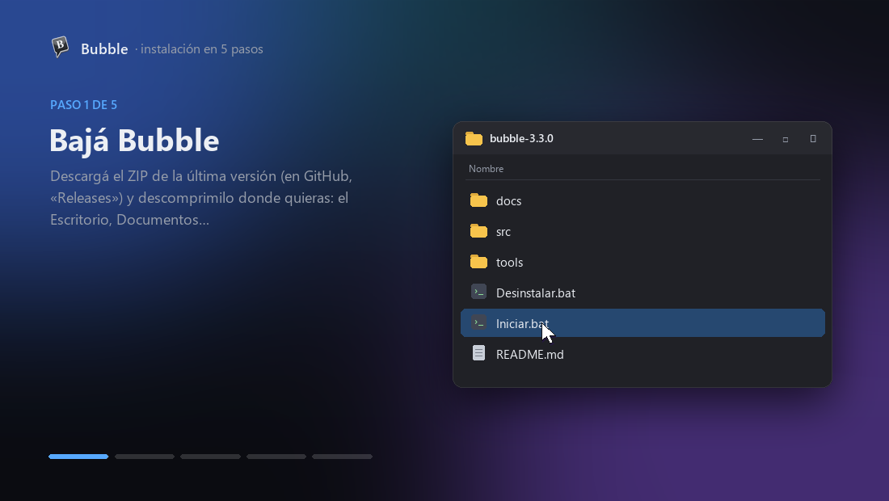
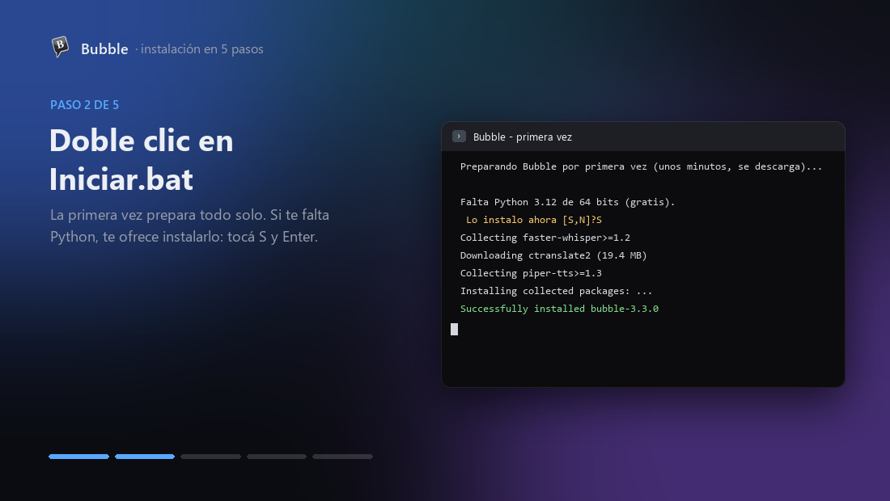
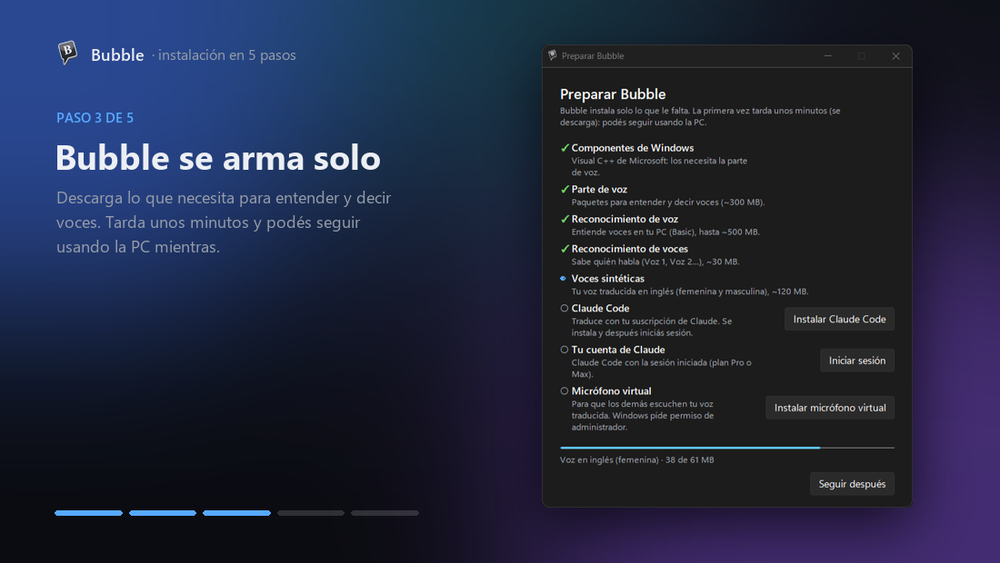
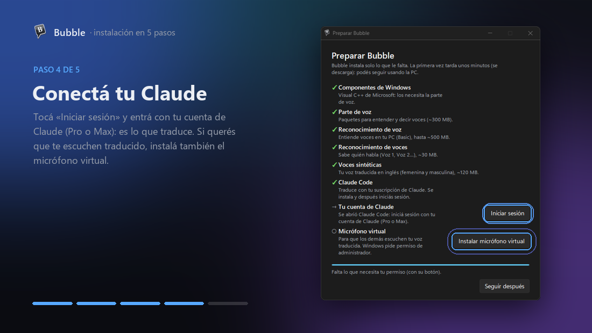
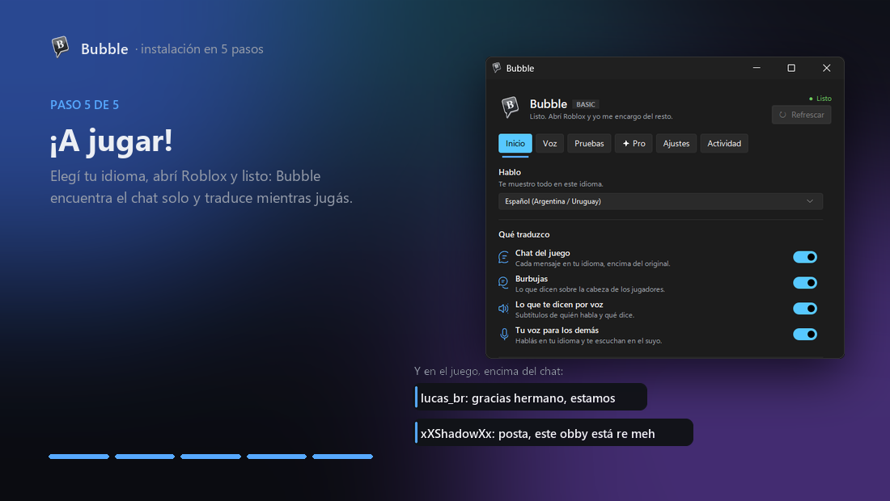

# Instalar Bubble

  

Son cinco pasos, y la mayoría los hace Bubble solo. La primera vez tarda unos diez minutos (depende de tu internet);
después abre en segundos, con el acceso directo del escritorio.

No hace falta saber programar ni tener nada instalado de antemano: si te falta algo, Bubble te lo ofrece.

 

## Antes de empezar

- **Windows 10 (versión 2004 o más nueva) u 11**, de 64 bits. Si tu PC tiene menos de cinco años, seguro está bien.
- **Una suscripción de Claude, Pro o Max.** Es lo que traduce. Bubble no te cobra nada ni te pide tarjetas.
  ¿Todavía no tenés? Bubble Pro traduce igual con el crédito de regalo de Deepgram (ver el paso 4).
- **Roblox**, el de roblox.com o el de la Microsoft Store: andan los dos.
- **Unos 1,5 GB libres** e internet.
- Si querés que te escuchen traducido: **auriculares con micrófono**.

> [!IMPORTANT]
> **Lo más importante es el micrófono.** Bubble te entiende tan bien como te escucha. Con uno de auriculares o uno
> USB cerca de la boca, todo sale mucho mejor que con el de la notebook. Probalo en **Inicio → Probar mi micrófono**.

 

## 1. Bajá Bubble

Entrá a [la última versión](https://github.com/Fnqqew/bubble/releases/latest) y bajá **Source code (zip)**. Después,
clic derecho sobre el ZIP → **Extraer todo**.

> **Un consejo:** dejá la carpeta en un lugar fijo, como Documentos. El acceso directo que crea Bubble apunta ahí:
> si después la movés, volvé a abrir `Iniciar.bat` desde el lugar nuevo y el acceso directo se arregla solo.

 

## 2. Doble clic en `Iniciar.bat`

Se abre una ventanita negra que prepara todo. Dejala trabajar: cuando termina, se cierra sola y abre Bubble.

- **Si Windows te dice «Windows protegió su PC»:** es porque el archivo vino de internet. Tocá **Más información →
  Ejecutar de todas formas**. Es un archivo de texto: si querés ver qué hace, abrilo con el Bloc de notas.
- **Si te falta Python** (lo que hace andar a Bubble), te pregunta *«Lo instalo ahora [S,N]?»*: tocá **S** y
  **Enter**. Si tu Windows no lo puede instalar solo, te abre la página de Python: bajalo, instalalo y volvé a abrir
  `Iniciar.bat`.

 

## 3. Bubble se arma solo

Se abre **Preparar Bubble** y baja lo que necesita para entender voces y hablar por vos: el reconocimiento de voz
(hasta ~500 MB), el que distingue quién habla (~30 MB) y las voces en inglés (~120 MB). Podés seguir usando la PC
mientras tanto.

Si a tu Windows le faltan unos componentes de Microsoft (Visual C++), aparece **Instalar componentes**: tocalo,
Windows te pide permiso y listo. Bubble nunca instala nada de Windows a escondidas.

 

## 4. Conectá tu Claude

Esta parte necesita que estés vos, porque es tu cuenta:

1. **Instalar Claude Code** (si no lo tenés): se abre el instalador oficial de Anthropic en una ventana aparte.
   Esperá a que termine.
2. **Iniciar sesión**: se abre Claude Code; seguí sus pasos y te lleva al navegador. Entrá con tu cuenta de Claude
   (la misma de claude.ai) y aceptá. Eso es todo: Bubble traduce con tu suscripción, sin claves ni pagos aparte.
3. **Instalar micrófono virtual** (opcional, pero es lo que hace que los demás te escuchen traducido): Windows pide
   permiso de administrador y, en el instalador, tocás **Install Driver**. Si te pide reiniciar, reiniciá.

**¿No tenés Claude, o tu cuenta es la gratuita?** Bubble te lo dice y te muestra dos caminos:

- **Bubble Pro con créditos gratis:** creás una cuenta en Deepgram (200 US$ de regalo, sin tarjeta), copiás la clave y
  la pegás en Bubble. Listo: traduce sin Claude. Ojo que así la traducción gasta crédito (unos 0,075 US$ por minuto
  con mensajes; la conexión se corta sola cuando el chat está quieto), y Bubble te lo recuerda. Mientras no conectes
  Claude, Pro queda activado y Basic se ve bloqueado.
- **Conectar Claude:** si te suscribís (con Claude Pro alcanza), tocás **Iniciar sesión en Claude** y después **Listo,
  revisar**. Bubble vuelve a traducir con tu suscripción, deja de gastar crédito y Basic se desbloquea.

 

## 5. ¡A jugar!

Elegí tu idioma y abrí Roblox. Bubble encuentra el chat solo y traduce mientras jugás.

Bubble se muestra en el idioma de tu Windows. Si preferís otro, cambialo en **Ajustes → Idioma de Bubble**.

- **Abrí Bubble antes que Roblox.** Así Roblox ya usa el micrófono virtual cuando arranca. Si Roblox ya estaba
  abierto, Bubble te avisa qué tocar.
- **Apagá la traducción automática de Roblox** (Esc → Configuración → *Traducción automática del chat*). Si no,
  Bubble lee mensajes ya traducidos y se pierde la jerga original.
- Un tutorial corto te acompaña la primera vez. Si lo salteás, está en **Ajustes → Ver el tutorial**.

 

## Bubble se adapta a tu PC

Cada vez que abre, Bubble mira tu memoria, tu procesador, tu pantalla, tus micrófonos y tu internet, y se acomoda
solo para que Roblox no se trabe. Si algo le impide andar bien, te lo dice en **Pruebas → Tu equipo**.

 

## Si algo se traba

- **«No se pudo preparar Bubble»:** casi siempre es internet. Revisá la conexión y volvé a abrir `Iniciar.bat`:
  sigue desde donde quedó.
- **«Tu Python es de 32 bits»:** abrí `Iniciar.bat` de nuevo: si solo encuentra uno de 32 bits, te ofrece instalar
  el de 64.
- **«Tu cuenta de Claude es gratuita»:** Bubble necesita Claude Pro o Max para traducir.
- **No lee el chat y dice que falta un idioma para leer texto:** Configuración de Windows → **Hora e idioma →
  Idioma y región** → agregá **Inglés** (instala el lector de texto que usa Bubble).
- **Los demás no te escuchan traducido:** en Roblox, elegí **CABLE Output** como micrófono (Esc → Configuración →
  *Dispositivo de entrada*), o cerrá y volvé a abrir Roblox con Bubble abierto.
- **Nada de esto:** escribinos desde Bubble, en **Ajustes → Ayuda → Soporte…** (o el link **Soporte** de abajo de
  todo). Contá qué pasó, sumá una captura si podés, y le llega directo al creador, con los datos de tu PC para
  entender el problema más rápido.

La guía completa, con cada parte de Bubble explicada, está en [GUIA.md](GUIA.md).

 

## Cuando salga una versión nueva

No tenés que volver a hacer nada de esto. Cuando hay una versión nueva, Bubble te avisa y te pregunta si actualizar
ahora o más tarde. Tarda menos de un minuto y no perdés nada de lo que configuraste. Nunca te pregunta en medio de
una partida.

Si no querés que te pregunte, prendé **Ajustes → Actualizar solo**: la versión nueva se baja sola y se instala cuando
no estás jugando.

 

## Desinstalar

**Ajustes → Desinstalar Bubble…** (o `Desinstalar.bat`). Elegís qué borrar: tu configuración, lo descargado, el
acceso directo, el micrófono virtual y la carpeta. Windows vuelve a usar tu micrófono de siempre, como si Bubble
nunca hubiera estado.
